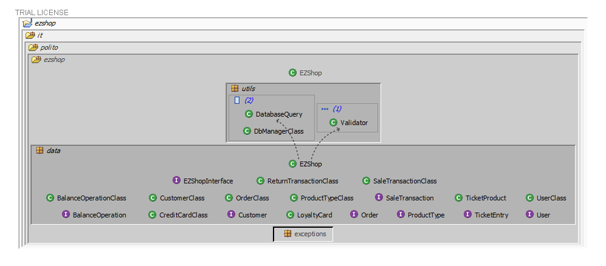
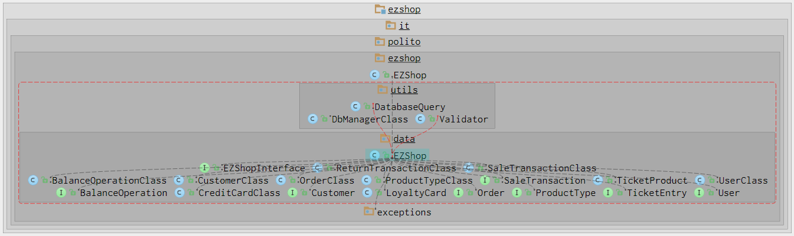

# Integration and API Test Documentation

Authors: Teresa Torresani, Riccardo Ossella, Aurora Anna Pia Sergio, Antonio Macaluso

Date: 26/05/21

Version: 1.5 (26/06/21) 

# Contents

- [Dependency graph](#dependency graph)

- [Integration approach](#integration)

- [Tests](#tests)

- [Scenarios](#scenarios)

- [Coverage of scenarios and FR](#scenario-coverage)
- [Coverage of non-functional requirements](#nfr-coverage)


# Dependency graph 

     <report the here the dependency graph of the classes in EzShop, using plantuml>

### PlantUML 

```plantuml


package ezshop.it.polito.ezshop {
top to bottom direction

class EzShop {
}

package data {
left to right direction
    class EZShop{
    }
    class BalanceOperationClass{
    }  
    class CreditCardClass{
    } 
    class CustomerClass{
    }     
    class LoyaltyCard{
    }   
    class OrderClass{
    } 
    class ProductTypeClass{
    }  
    class ReturnTransactionClass{
    }  
    class SaleTransactionClass{
    }  
    class TicketProduct{
    }  
    class UserClass{
    }  
    
    
    
}


package exceptions {
   legend top
    this package contains all the exceptions
    provided for the EZShop application
   endlegend
}


package utils {
    class DatabaseQuery{
    }  
    class DbManagerClass{
    }  
    class Validator{
    }  
}
    EzShop ..> DbManagerClass
    EzShop ..> EZShop
    EZShop ..> BalanceOperationClass
    EZShop ..> CreditCardClass
    EZShop ..> CustomerClass
    EZShop ..> LoyaltyCard
    EZShop ..> OrderClass
    EZShop ..> ProductTypeClass
    EZShop ..> ReturnTransactionClass
    EZShop ..> SaleTransactionClass
    SaleTransactionClass ..> TicketProduct
    EZShop ..> TicketProduct
    EZShop ..> UserClass
    EZShop ..> exceptions
    EZShop ..> Validator
    EZShop ..> DatabaseQuery
    DatabaseQuery ..> DbManagerClass

}


```

### From Structure101 Studio5 for Java

### Via Structure101 Intellij Plugin

# Integration approach

    <Write here the integration sequence you adopted, in general terms (top down, bottom up, mixed) and as sequence
    (ex: step1: class A, step 2: class A+B, step 3: class A+B+C, etc)> 
    <Some steps may  correspond to unit testing (ex step1 in ex above), presented in other document UnitTestReport.md>
    <One step will  correspond to API testing>

We adopted a bottom up approach, testing independent classes first, in the following sequence:

- **Step 1**: BalanceOperationClass, CreditCardClass, CustomerClass, LoyaltyCard, OrderClass, ProductTypeClass,
ReturnTransactionClass, TicketProduct, Product, UserClass and Validator (all the tests in the folder blackBox Testing)

- **Step 2**: SaleTransactionClass + TicketProduct, since we could not test SaleTransactionClass alone because we needed
to know for sure that the TicketProduct objects were not affected by bugs

- **Step 3**: DatabaseQuery + DBManagerClass + all the previously tested classes

- **Step 4**: EZShop + DatabaseQuery + DBManagerClass + all the previous ones    


- **Step 5**: Product + all the previous ones


#  Tests

   <define below a table for each integration step. For each integration step report the group of classes under test, and the names of
     JUnit test cases applied to them> JUnit test classes should be here src/test/java/it/polito/ezshop

## Step 1

| Classes |  JUnit test cases |
| ------------- |:-------------:|
| BalanceOperationClass | **Class** blackBoxTesting/BalanceOperationClassTest </br>**Methods** testSetBalanceId, testSetDate, testSetMoney, testSetType |
| CreditCardClass | **Class** blackBoxTesting/CreditCardClassTest </br>**Methods** testSetCardCredit|
| CustomerClass | **Class** blackBoxTesting/CustomerClassTest </br>**Methods** testSetCustomerName, testSetCustomerCard, testSetId, testSetPoints, testPointsNotNegative, testCustomerClassConstructor_nameAndCustomerCard, testCustomerClassConstructor_nameAndID|
| LoyaltyCard | **Class** blackBoxTesting/LoyaltyCardTest </br>**Methods** testAddPoints, testSetID, testSetPoints, testSetCardOwnerID, testPointsNotNegative|
| OrderClass | **Class** blackBoxTesting/OrderClassTest </br>**Methods** testSetBalanceId, testSetProductCode, testSetPricePerUnit, testSetQuantity, testSetStatus, testSetOrderId, testSetDate, testSetMoney, testSetType |
| ProductTypeClass | **Class** blackBoxTesting/ProductTypeClassTest </br>**Methods** testSetId, testSetProductDescription, testSetBarCode, testSetPricePerUnit, testSetNote, testSetQuantity, testSetLocation |
| ReturnTransactionClass | **Class** blackBoxTesting/ReturnTransactionClassTest </br>**Methods** testConstructor, testConstructor1, testAddProduct, testSetClosed, testSetPayed, testSetProduct |
| TicketProduct | **Class** blackBoxTesting/TicketProductTest </br>**Methods** testSetBarCode, testSetProductDescription, testSetAmount, testSetPricePerUnit, testSetDiscountRate |
| Product | **Class** blackBoxTesting/ProductTest </br>**Methods** setup, testSetRfid, testCheckStatus, testSetStatus, testSetProductCode |
| UserClass | **Class** blackBoxTesting/UserClassTest </br>**Methods** testSetId, testSetUsername, testSetPassword, testSetRole|
| Validator | **Class** blackBoxTesting/ValidatorTest </br>**Methods** testCheckBarCode, testCheckPositionFormat, testCheckCreditCard |


## Step 2

| Classes |  JUnit test cases |
| ------------- |:-------------:|
| SaleTransactionClass | **Class** integrationTesting/SaleTransactionClassTest </br>**Methods** testSetTicketNumber, testSetEntries, testAddEntry, testRemoveEntry, testSetDiscountRate, testSetPrice, testSetClosed, testSetPayed |
| TicketProduct </br>(same as step 1)| **Class** blackBoxTesting/TicketProductTest </br>**Methods** testSetBarCode, testSetProductDescription, testSetAmount, testSetPricePerUnit, testSetDiscountRate |


## Step 3

| Classes |  JUnit test cases |
| ------------- |:-------------:|
| DatabaseQuery + DBManagerClass | **Class** integrationTesting/DatabaseQueryTest </br>**Methods** testGet_users, testCreateUser, testDeleteUser, testUpdateUserRole, testGetUserByUsername, testGet_products, testCreateProductType, testUpdateProductType, testUpdateQuantity, testUpdatePosition, testDeleteProductType, testCreateOrder, testUpdateOrderStatus, testCreateSaleTransaction, testAddTicketEntry, testDeleteTicketEntry, testUpdateTicketEntryAmount, testUpdateTicketEntryDiscount, testUpdateSaleDiscountRate, testUpdateSaleClosed, testUpdateSalePaid, testCreateReturnTransaction, testUpdateReturnTransaction, testCreateBalanceTransaction, testAddProductToTransaction, testGetProductsOfTransaction, testDeleteReturnTransaction, testDeleteSaleTransaction, testGetAllReturnTransactions, testGetAllCustomers, testGetAllLoyaltyCards, testDefineCustomer, testDeleteCustomer, testCreateCard, testAttachCardToCustomer, testModifyCustomer_empty, testModifyCustomer_null, testModifyCustomer_valid, testModifyPointsOnCard_cardNotAssociated, testModifyPointsOnCard_cardAssociated, testGetNextCardID, testGetAllSaleTransactions, testGetAllTicketEntries, testGetAllBalanceOperationsBetweenDates, testGetAllOrders, testGetBalanceQuantity, testSetBalanceQuantity, testAddTicketEntryRFID, testdeleteTicketEntryRFID, testUpdateRFIDBarcodeStatus |

## Step 4

| Classes |  JUnit test cases |
| ------------- |:-------------:|
| EzShop | **Class** integrationTesting/OrdersSaleTransactionTest </br>**Methods** testGetDataFromDb, testReset, testIssueOrder, testPayOrderFor, testPayOrder, testRecordOrderArrival, testRecordOrderArrivalRFID, testGetAllOrders, testStartSaleTransaction, testAddProductToSale testAddProductToSaleRFID, testDeleteProductFromSale, testDeleteProductFromSaleRFID testApplyDiscountRateToProduct, testApplyDiscountRateToSale, testComputePointsForSale, testEndSaleTransaction, testDeleteSaleTransaction, testGetSaleTransaction, testReceiveCashPayment, testReceiveCreditCardPayment |
| " |  **Class** integrationTesting/CustomerClassTest </br>**Methods** testDefineCustomer_databaseDisconnected, testDefineCustomer_customerNameAlreadyExists, testDefineCustomer_successfulDefine, testDefineCustomer_InvalidCustomerIdException, defineCustomer_UnauthorisedException, testModifyCustomer_databaseDisconnected, testModifyCustomer_InvalidCustomerCardException, testModifyCustomer_InvalidCustomerNameException, testModifyCustomer_SuccessfulRenaming, testModifyCustomer_SuccessfulRenamingAndCardUpdate, testModifyCustomer_SuccessfulCardRemoval, testModifyCustomer_CardUnchanged, modifyCustomer_UnauthorisedException, testDeleteCustomer_databaseDisconnected, testDeleteCustomer_verifyUserRemoval, testDeleteCustomer_InvalidCustomerIdException, deleteCustomer_UnauthorisedException, getCustomer_InvalidCustomerIdException, getCustomer_userDoesntExist, getCustomer_UnauthorisedException, getCustomer_isSuccessful, testGetAllCustomers_checkReturn, getAllCustomers_UnauthorisedException |
| " |  **Class** integrationTesting/LoyaltyCardTest </br>**Methods** createCard_databaseDisconnected, createCard_addingCard, createCard_UnauthorizedException, attachCardToCustomer_databaseDisconnected, attachCardToCustomer_successfulAttach, attachCardToCustomer_InvalidCustomerIdException, attachCardToCustomer_InvalidCustomerCardException, attachCardToCustomer_cardtoAnotherUser, attachCardToCustomer_noUserWithGivenID, modifyPointsOnCard_databaseDisconnected, modifyPointsOnCard_UnauthorisedException, modifyPointsOnCard_InvalidCustomerCardException, modifyPointsOnCard_noCardWithGivenCode, modifyPointsOnCard_verifyBalance, attachCardToCustomer_cardAlreadyAssigned, attachCardToCustomer_UnauthorizedException |
| " |  **Class** integrationTesting/ProductTypeTest </br>**Methods** createProductType, updateProduct, deleteProductType, getAllProductTypes, getProductTypeByBarCode, getProductTypesByDescription, updateQuantity, updatePosition |
| " |  **Class** integrationTesting/ReturnTransactionClassTest </br>**Methods** testStartReturnTransaction, testReturnProduct, testReturnProductRFID, testEndReturnTransaction, testDeleteReturnTransaction, testReturnCashPayment, testReturnCreditCardPayment |
| " | **Class** integrationTesting/SaleTransactionClassTest </br>**Methods** testSetTicketNumber, testSetEntries, testAddEntry, testRemoveEntry, testSetDiscountRate, testSetPrice, testSetClosed, testSetPayed |
| " |  **Class** integrationTesting/UserClassTest </br>**Methods** setLoggedUser, createUser, deleteUser, getAllUsers, getUser, updateUserRights, logout |
| " |  **Class** integrationTesting/BalanceTest </br>**Methods** testRecordBalanceUpdate, testGetCreditsAndDebits, testComputeBalance |


# Scenarios

<If needed, define here additional scenarios for the application. Scenarios should be named
 referring the UC in the OfficialRequirements that they detail>

## Scenario UCx.y

| Scenario |  name |
| ------------- |:-------------:| 
|  Precondition     |  |
|  Post condition     |   |
| Step#        | Description  |
|  1     |  ... |  
|  2     |  ... |

## Scenario UC1.4

| Scenario |  Delete product type X |
| ------------- |:-------------:| 
|  Precondition     | Employee C exists and is logged in |
|  | Product type X exists |
|  Post condition     | X deleted  |
| Step#        | Description  |
| 1     | C searches X via bar code |
|  2    |  X deleted from the system |

## Scenario UC1.5

| Scenario |  Get all product type records |
| ------------- |:-------------:| 
|  Precondition     |  Employee C exists and is logged in |
|  | Product type P* records exist |
|  Post condition     | Records of product type P* are retrieved from the DB as a list |
| Step#        | Description  |
|  1    |  C asks the system a complete list of product type records in the DB |
|  2    |  A list of product type P* records is successfully retrieved from the DB search | 

## Scenario UC1.6
| Scenario |  Get product type by bar code |
| ------------- |:-------------:| 
|  Precondition     | Employee C exists and is logged in |
|  | Product type X exists |
|  Post condition     | Product type X is retrieved from the DB |
| Step#        | Description  |
|  1    |  C searches X via bar code |
|  2    |  X entry is successfully retrieved from the DB search |

## Scenario UC1.7
| Scenario |  Get product type by description |
| ------------- |:-------------:| 
|  Precondition     | Employee C exists and is logged in |
|  | Product type X exists |
|  Post condition     | Product type X is retrieved from the DB |
| Step#        | Description  |
|  1    |  C searches X via product type description |
|  2    |  X entry is successfully retrieved from the DB search |

## Scenario 1.8
| Scenario |  Modify product type quantity |
| ------------- |:-------------:| 
|  Precondition     | Employee C exists and is logged in |
|  | Product type X exists |
|  | Quantity Q is free |
|  Post condition     | Q.quantity = L |
| Step#        | Description  |
|  1    |  C searches X via bar code |
|  2    |  C selects X's record |
|  3    |  C insert the product quantity |

## Scenario UC2.4

| Scenario |  Get all user records |
| ------------- |:-------------:| 
|  Precondition     |  Employee C exists and is logged in |
|  | User U* records exist |
|  Post condition     | Records of User U* are retrieved from the DB as a list |
| Step#        | Description  |
|  1    |  C asks the system a complete list of user records in the DB |
|  2    |  A list of user records is successfully retrieved from the DB search | 

## Scenario UC2.5
| Scenario |  Get user record |
| ------------- |:-------------:| 
|  Precondition     | Employee C exists and is logged in |
|  | User X exists |
|  Post condition     | User X is retrieved from the DB |
| Step#        | Description  |
|  1    |  C asks for X personal ID |
|  2    |  C searches X via ID |
|  3    |  X entry is successfully retrieved from the DB search |


## Scenario UC3.4

| Scenario |  Order of product type X issued and paid |
| ------------- |:-------------:| 
|  Precondition     | Shop Manager S exists and is logged in |
| | Product type X exists|
|  Post condition     |  Order O exists and is in PAYED state |
| | Balance -= Order.units * Order.pricePerUnit |
| | X.units not changed |
| Step#        | Description  |
|  1     |  S creates order O |  
|  2     |  S fills  quantity of product to be ordered and the price per unit |
|  3     |  S register payment done for O |
|  4     |  O is recorded in the system in PAYED state |

## Scenario UC3.5

| Scenario |  List all orders |
| ------------- |:-------------:| 
|  Precondition     | Shop Manager S exists and is logged in |
|  Post condition     |  S obtains a list containing all orders |
| Step#        | Description  |
|  1     |  S clicks on the Orders window |  
|  2     |  The system shows all the orders and their status |

## Scenario UC4.5

| Scenario |  Delete customer record |
| ------------- |:-------------:| 
|  Precondition     | Account U for Customer Cu existing  |
|  Post condition     | Account U for Customer Cu is deleted  |
| Step#        | Description  |
|  1    |  User asks for Cu personal ID |
|  2    |  User search Cu ID on the customer DB |  
|  3    |  Cu entry is retrieved from the DB search |  
|  3    |  User removes Cu ID from the customer DB  |
|  4    |  Cu entry is successfully deleted |

## Scenario UC4.6

| Scenario |  Get customer record |
| ------------- |:-------------:| 
|  Precondition     | Account U for Customer Cu existing  |
|  Post condition     | Account U for Customer Cu is retrieved from the DB  |
| Step#        | Description  |
|  1    |  User asks for Cu personal ID |
|  2    |  User search Cu ID on the customer DB |  
|  3    |  Cu entry is successfully retrieved from the DB search |  

## Scenario UC4.7

| Scenario |  Get all customer records |
| ------------- |:-------------:| 
|  Precondition     | Multiple Account U* for Customer Cu* exist  |
|  Post condition     |  Accounts U* for Customer Cu* entries are retrieved from the DB as a list |
| Step#        | Description  |
|  1    |  User asks the system a complete list of Customer Cu* Accounts A* in the DB |
|  2    |  A list of A* Accounts from Customers Cu* is successfully retrieved from the DB search | 

## Scenario UC4.8

| Scenario |  Get all customer records |
| ------------- |:-------------:| 
|  Precondition     | Loyalty card L doesn't exist |
|  Post condition     |  Loyalty card L is created |
| Step#        | Description  |
|  1    |  User generates a new Loyalty Card from the related system interface |
|  2    |  A new LoyaltyCard L with a unique ID is generated | 
|  3    |  LoyaltyCard L is added on the DB | 

## Scenario UC4.9

| Scenario |  Get all customer records |
| ------------- |:-------------:| 
|  Precondition     | Loyalty card L exists |
|                   | Points Variation PV doesn't lower the validity of Loyalty Card L points balance below zero |
|  Post condition   | Loyalty card L points balance is successfully updated |
| Step#        | Description  |
|  1    |  User retrieves Loyalty Card L from the DB |
|  2    |  Loyalty Card L point balance is updated with a new Points Variation PV | 
|  3    |  Loyalty Card L entry is successfully updated on the DB |

##Scenario UC6.7

| Scenario |  Cancel Product from Sale S |
| ------------- |:-------------:| 
|  Precondition     | Cashier C exists and is logged in |
| | Sale S has been created and is still open |
| | N units of Product type X are included in the Sale S, and N > amount to remove |
|  Post condition     | Balance += N*X.unitPrice  |
| | S updated |
| | X.quantity += N |
| Step#        | Description  |
|  1    |  C selects entry X in S |  
|  2    |  C inserts the number of units to remove |
|  3    |  C removes N units of X from the sale |
|  4    |  X available quantity is increased by N |
|  5    |  C closes the sale transaction |
|  6    |  System asks payment type |
|  7    |  Manage  payment (see UC7) |
|  8    |  Payment successful |
|  9   |  C confirms the sale and prints the sale receipt |
|  10   |  Balance is updated |

##### Scenario 9.2

| Scenario |  Record debit |
| ------------- |:-------------:| 
|  Precondition     | Manager C exists and is logged in |
|  Post condition     |  Current balance value displayed  |
| Step#        | Description  |
|  1    |  C ask the system the current balance value |
|  4    |  The system returns the current balance value |
|  5    |  The current balance value is displayed  |


# Coverage of Scenarios and FR

<Report in the following table the coverage of  scenarios (from official requirements and from above) vs FR. 
Report also for each of the scenarios the (one or more) API JUnit tests that cover it. >

| Scenario ID | Functional Requirements covered | JUnit  Test(s) | 
| ----------- | ------------------------------- | ----------- | 
|  1.1        | FR3.1                           |  **Class** integrationTesting/ProductTypeTest</br>**Method** testCreateProductType |
|  1.2        | FR4.2                           |  **Class** integrationTesting/ProductTypeTest</br>**Method** testUpdatePosition |
|  1.3        | FR3.1                           |  **Class** integrationTesting/ProductTypeTest</br>**Method** testUpdateProductType |
|  1.4        | FR3.2                           |  **Class** integrationTesting/ProductTypeTest</br>**Method** testDeleteProductType |
|  1.5        | FR3.3                           |  **Class** integrationTesting/ProductTypeTest</br>**Method** testGetAllProductTypes |
|  1.6        | FR3.4                           |  **Class** integrationTesting/ProductTypeTest</br>**Method** testGetProductTypeByBarCode |
|  1.7        | FR3.4                           |  **Class** integrationTesting/ProductTypeTest</br>**Method** testGetProductTypesByDescription |
|  1.8        | FR4.1                           |  **Class** integrationTesting/ProductTypeTest</br>**Method** testUpdateQuantity |
|  2.1        | FR1.1                           |  **Class** integrationTesting/UserClassTest</br>**Method** testCreateUser |
|  2.2        | FR1.2                           |  **Class** integrationTesting/UserClassTest</br>**Method** testDeleteUser |
|  2.3        | FR1.5                           |  **Class** integrationTesting/UserClassTest</br>**Method** testUpdateUserRights |
|  2.4        | FR1.3                           |  **Class** integrationTesting/UserClassTest</br>**Method** testGetAllUsers |
|  2.5        | FR1.4                           |  **Class** integrationTesting/UserClassTest</br>**Method** testGetUser |
|  3.1        | FR4.3                           |  **Class** integrationTesting/OrdersSaleTransactionTest</br>**Method** testIssueOrder                                       |
|  3.4        | FR4.4                           |  **Class** integrationTesting/OrdersSaleTransactionTest</br>**Method** testPayOrderFor                                       |
|  3.2        | FR4.5                           |  **Class** integrationTesting/OrdersSaleTransactionTest</br>**Method** testPayOrder                                       |
|  3.3        | FR4.6                           |  **Class** integrationTesting/OrdersSaleTransactionTest</br>**Method** testRecordOrderArrival, testRecordOrderArrivalRFID                                       |
|  3.5        | FR4.7                           |  **Class** integrationTesting/OrdersSaleTransactionTest</br>**Method** testGetAllOrders                                       |
|  4.1        | FR5.1                           |  **Class** integrationTesting/CustomerClassTest</br>**Method** testDefineCustomer_successfulDefine           |
|  4.2        | FR5.6                           |  **Class** integrationTesting/LoyaltyCardTest</br>**Method** attachCardToCustomer_successfulAttach           |         
|  4.3        | FR5.6                           |  **Class** integrationTesting/CustomerClassTest</br>**Method** testModifyCustomer_SuccessfulCardRemoval        |      
|  4.4        | FR5.6                           |  **Class** integrationTesting/CustomerClassTest</br>**Method** testModifyCustomer_SuccessfulRenaming, testModifyCustomer_SuccessfulCardRemoval, testModifyCustomer_CardUnchanged           |              
|  4.5        | FR5.2                           |  **Class** integrationTesting/CustomerClassTest</br>**Method** testDeleteCustomer_verifyUserRemoval           |              
|  4.6        | FR5.3                           |  **Class** integrationTesting/CustomerClassTest</br>**Method** getCustomer_isSuccessful          |              
|  4.7        | FR5.4                           |  **Class** integrationTesting/CustomerClassTest</br>**Method** testGetAllCustomers_checkReturn          |              
|  4.8        | FR5.5                           |  **Class** integrationTesting/LoyaltyCardTest</br>**Method** createCard_addingCard          |              
|  4.9        | FR5.7                           |  **Class** integrationTesting/LoyaltyCardTest</br>**Method** modifyPointsOnCard_verifyBalance          |              
|  5.1        | FR1.5                          |  **Class** integrationTesting/UserClassTest</br>**Method** testLogin |
|  5.2        | FR1.5                          |  **Class** integrationTesting/UserClassTest</br>**Method** testLogout |
|  6.1        | FR6.1                           |  **Class** integrationTesting/OrdersSaleTransactionTest</br>**Method** testStartSaleTransaction |
|             | FR6.7                           |  **Class** integrationTesting/ProductTypeTest</br>**Method** getProductTypeByBarCode |
|             | FR6.2                           |  **Class** integrationTesting/OrdersSaleTransactionTest</br>**Method** testAddProductToSale, testAddProductToSaleRFID |
|             | FR6.8                           |  **Class** integrationTesting/OrdersSaleTransactionTest</br>**Method** getAllTicketEntries |
|             | FR6.10                          |  **Class** integrationTesting/OrdersSaleTransactionTest</br>**Method** testEndSaleTransaction |
|             | FR8.2                           |  **Class** integrationTesting/BalanceTest</br>**Method** recordBalanceUpdate |
|  6.2        | FR6.5                           |  **Class** integrationTesting/OrdersSaleTransactionTest</br>**Method** testApplyDiscountRateToProduct  |
|  6.7        | FR6.3                           |  **Class** integrationTesting/OrdersSaleTransactionTest</br>**Method** testDeleteProductFromSale, testDeleteProductFromSaleRFID |
|  6.3        | FR6.4                           |  **Class** integrationTesting/OrdersSaleTransactionTest</br>**Method** testApplyDiscountRateToSale |
|  6.4        | FR6.6                           |  **Class** integrationTesting/OrdersSaleTransactionTest</br>**Method** testComputePointsForSale |
|  6.5        | FR6.11                          |  **Class** integrationTesting/OrdersSaleTransactionTest</br>**Method** testDeleteSaleTransaction</br> |
|  7.4        | FR7.1                           |  **Class** integrationTesting/OrdersSaleTransactionTest</br>**Method** testReceiveCashPayment |
|  7.1        | FR7.2                           |  **Class** integrationTesting/OrdersSaleTransactionTest</br>**Method** testReceiveCreditCardPayment |
|  7.2        | FR7.2                           |  **Class** integrationTesting/OrdersSaleTransactionTest</br>**Method** testReceiveCreditCardPayment |
|  7.3        | FR7.2                           |  **Class** integrationTesting/OrdersSaleTransactionTest</br>**Method** testReceiveCreditCardPayment |
|  8.1 - 8.2  | FR6.12                          |  **Class** integrationTesting/ReturnTransactionClassTest</br>**Method** testStartReturnTransaction |
|             | FR6.7                           |  **Class** integrationTesting/ProductTypeTest</br>**Method** getProductTypeByBarCode |
|             | FR6.13                          |  **Class** integrationTesting/ReturnTransactionClassTest</br>**Method** testReturnProduct, testReturnProductRFID |
|             | FR6.14                          |  **Class** integrationTesting/ReturnTransactionClassTest</br>**Method** testEndReturnTransaction |
|             | FR8.1                           |  **Class** integrationTesting/BalanceTest</br>**Method** recordBalanceUpdate |
|  9.1        | FR8.3                           |  **Class** integrationTesting/BalanceTest</br>**Method** testGetCreditsAndDebits |
|  9.2        | FR8.4                           |  **Class** integrationTesting/BalanceTest</br>**Method** testComputeBalance |
|  10.1       | FR7.4                           |  **Class** integrationTesting/ReturnTransactionClassTest</br>**Method** testReturnCreditCardPayment |
|  10.2       | FR7.3                           |  **Class** integrationTesting/ReturnTransactionClassTest</br>**Method** testReturnCashPayment |

# Coverage of Non Functional Requirements


<Report in the following table the coverage of the Non Functional Requirements of the application - only those that can be tested with automated testing frameworks.>

| Non Functional Requirement | Test name |
| -------------------------- | --------- |
|             **NFR1** (Application should be used with no specific training for the users) | The Usability of the application is granted by the provided GUI and assured by all the tests |
|             **NFR2** (All functions should complete in < 0.5 sec) | All the tests we made (which sometimes include multiple iterations of the functions) execute in less than 0.5 seconds |
|             **NFR4** (The credit cards numbers should be validated through the Luhn algorithm)| **Class** blackBoxTesting/ValidatorTest</br>**Method** testCheckCreditCard |
|             **NFR5** (The barcode number related to a product type should be a string of digits of either 12, 13 or 14 numbers validated following this algorithm  https://www.gs1.org/services/how-calculate-check-digit-manually) | **Class** blackBoxTesting/ValidatorTest</br>**Method** testCheckBarCode |
|             **NFR6** (The customer's card should be a string of 10 digits) | **Class** blackBoxTesting/LoyaltyCardTest</br>**Method** testSetID </br>**Class** blackBoxTesting/CustomerClassTest</br>**Method** testSetCustomerCard ||


