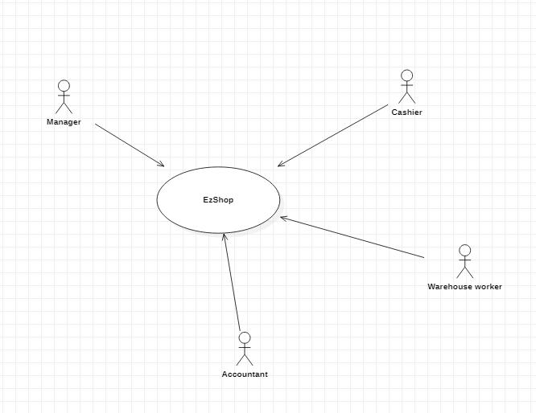
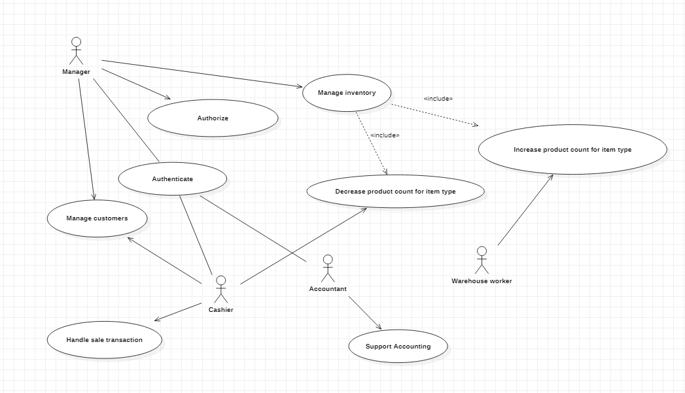
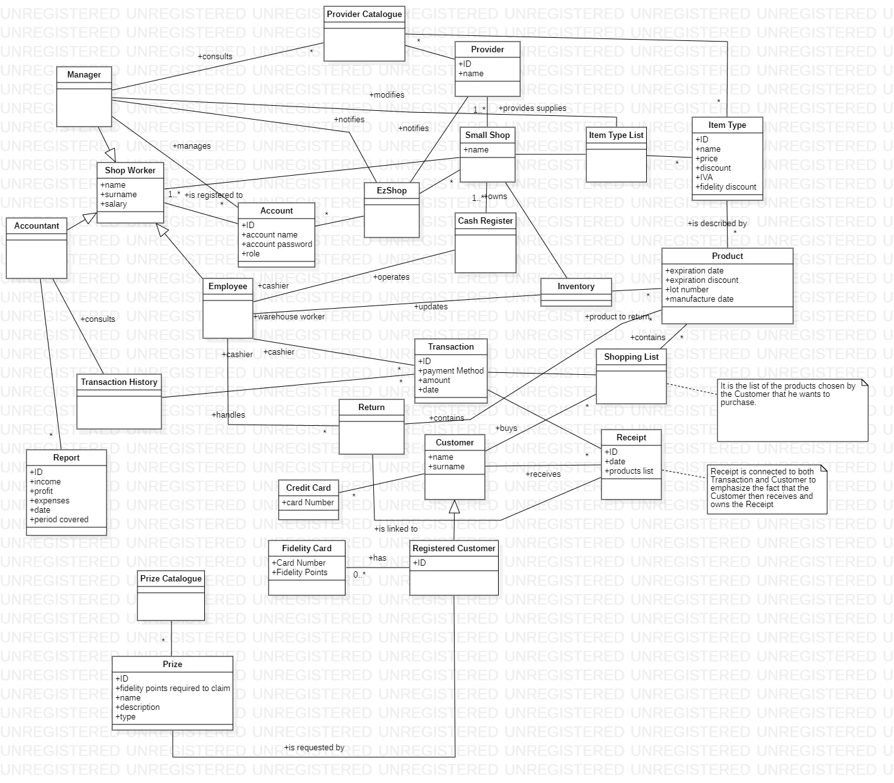
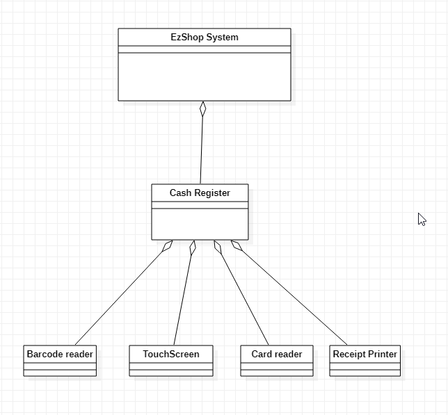
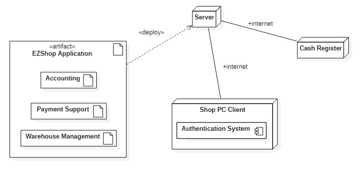

# Requirements Document 

Authors: Teresa Torresani, Riccardo Ossella, Aurora Anna Pia Sergio, Antonio Macaluso

Date: 21/04/21

Version: 1.3 (26/06/21)

# Contents

- [Essential description](#essential-description)
- [Stakeholders](#stakeholders)
- [Context Diagram and interfaces](#context-diagram-and-interfaces)
	+ [Context Diagram](#context-diagram)
	+ [Interfaces](#interfaces) 
	
- [Stories and personas](#stories-and-personas)
- [Functional and non functional requirements](#functional-and-non-functional-requirements)
	+ [Functional Requirements](#functional-requirements)
	+ [Non functional requirements](#non-functional-requirements)
- [Use case diagram and use cases](#use-case-diagram-and-use-cases)
	+ [Use case diagram](#use-case-diagram)
	+ [Use cases](#use-cases)
    	+ [Relevant scenarios](#relevant-scenarios)
- [Glossary](#glossary)
- [System design](#system-design)
- [Deployment diagram](#deployment-diagram)

# Essential description

Small shops require a simple application to support the owner or manager. A small shop (ex a food shop) occupies 50-200 square meters, sells 500-2000 different item types, has one or a few cash registers 
EZShop is a software application to:
* manage sales
* manage inventory
* manage customers
* support accounting

# Stakeholders

| Stakeholder name  | Description | 
| ----------------- |:-----------:|
|       Manager        |    The person that supervises all the shop activities    |
| Cashier | The person that handles the transactions interacting with the customer |
| Customers | The people that buy product/s from the store |
| Warehouse worker | The person in charge of organizing the warehouse |
| Providers | Companies that sell products to the store |
| Software Maintainer | The person in charge of maintaining operative the software (eg. checking the database) |
| Accountant | The person that evaluates the income and expenses |
| Products | The items that the shop handles (buys, sells) |

# Context Diagram and interfaces

## Context Diagram

## Interfaces

| Actor | Logical Interface | Physical Interface  |
| ------------- |:-------------:| -----:|
|   Manager     | Software Application's Admin GUI | Screen, Keyboard, Mouse |
|   Cashier     | Software Application's Cashier GUI | Cash Register touch screen, Barcode Reader |
|   Warehouse worker     | Interface with the Database | Barcode reader |
|   Accountant     | Software Application's transaction history/recap GUI | Screen, Keyboard, Mouse |

# Stories and personas

### Jim Williams

**Age**: 25

**Job**: Student and part time cashier

Jim is a part-time cashier at a small supermarket in its hometown and an engineering student. He is responsible of operating the cash register and handling sale transactions during the day.

**Goals:**
* Wants to manage the sale transactions in a fast and efficient way
* Wants to reduce the average queue time of customers at the shop

**Story**

It's Friday afternoon. Jim starts his turn at the shop, makes a fast login through the cash register interface and it's ready to welcome the first customer. After a few minutes, due to the Easter holidays happening in a couple of days, the shop is packed of customers willing to make last minute purchases.

As the queue starts growing in front of the cash register, Jim relies on his barcode reader to quickly scan the first customer's products: every item from the shop is already stored in the database with its current price and related discount to facilitate the process. The customer forgot his wallet at home and asks for a Bancomat payment: Jim provides to him the mobile POS at the counter and quickly validates the transaction.

At the end of the workshift, Jim logs out from the cash register and finally gets home.

### Jessie Rodriguez

**Age**: 32

**Job**: Warehouse worker

Jessie is a warehouse worker in a food shop and a mother of two children.

**Goals:**
* Wants to manage the warehouse availability of products in a quick and reliable way
* Needs a guarantee on the expiration date of certain products in the shop

**Story**

It's Monday at 6.00 AM. Jessie enters the warehouse and waits for the delivery trucks. The first shipment comes in with some boxes of soup cans ang long conservation products. Jessie double checks the orders, moves in the boxes and makes an inventory of the new products, updating the shop database accordingly and taking note of the expiration dates. 

Some products in the warehouse are expiring today: Jessie is notified from the DB software and acts accordingly by properly disposing the outdated products.

Once the database is properly updated and the warehouse is cleaned up, Jessie can rest until the arrival of the next truck in the following day.

### Marie White

**Age**: 43

**Job**: Manager

Marie is a long time manager of a local supermarket in her hometown.

**Goals:**
* Wants to properly keep in touch with workers from the shop, the warehouse and the accounting department
* Wants to be updated on the economic situation of the shop
* Wants to update the shop product assortment depending on the situation

**Story**

It's Wednesday afternoon and Marie comes back to the office after a quick lunch break. The manager decides to make some new additions to the shop database by adding some new toys and board games in view of the upcoming Christmas holidays.

Firstly, she logs in to the platform and checks the accounting section to ensure that the new purchases don't exceed the 5% of the current balance. Then, she makes the new orders and updates the accounting balance and the database with the new products info so that the workers in the warehouse can be notified as well.

### Pedro Garcia

**Age**: 49

**Job**: Accounting

Pedro is an accountant of a small videogame store in a mall and a football coach on weekends. He is married and the father of a 4 years old girl.

**Goals:**
* Wants to check the store overall balance
* Wants to check the sale performance of a single product from the store

**Story**

It's the end of the week and Pedro decides to take a look on the overall balance of the videogame shop: by logging to the database and accessing to the sales info, he realizes a big spike on a family title for the Play Station that happened during the last two days thanks to some heavy TV advertisement from the game company.

On the other side, the release of a new racing game lowered the sales of some older titles from the same genre. Pedro decides to notify its manager about this and suggest a discount on those products in order to increase their appeal to the customers.

# Functional and non functional requirements

## Functional Requirements

| ID        | Description  |
| ------------- |:-------------:| 
|  FR1     | Handle sale transaction |
|  FR1.1     | Start sale transaction |
|  FR1.2     | Cancel sale transaction |
|  FR1.3     | Read bar code retrieving associated information |
|  FR1.4     | End sale transaction |
|  FR1.5     | Payment management |
|  FR1.6     | Update transaction history |
|  FR1.7     | Apply discounts  |
|  FR1.7.1     | Apply item type discount  |
|  FR1.7.2     | Apply fidelity card discount  |
|  FR1.8     | Read fidelity card  |
|  FR1.9     | Print receipt  |
|  FR2     |  Manage customers |
|  FR2.1     |  Create user with associated fidelity card |
|  FR2.2     |  Delete user and fidelity card |
|  FR2.3     |  Update points of the customer card |
|  FR2.4     |  User can claim prize |
|  FR2.5     | Manage discounts for registered customers (customer presenting their fidelity card) |
| FR3  | Manage inventory | 
| FR3.1  | Add item type | 
| FR3.2  | Remove item type | 
| FR3.3  | Update product count for item type | 
| FR3.3.1  | Increase product count for item type | 
| FR3.3.2  | Decrease product count for item type | 
| FR3.4  | Notify Providers (product running out) | 
| FR3.5  | Notify Manager (expiring product) | 
| FR3.6  | Update item type info (price, discounts) | 
| FR3.6.1  | Update item type price | 
| FR3.6.2  | Update item type discount | 
|  FR4  | Support Accounting |
|  FR4.1  | Display transaction history |
|  FR4.2  | Display transactions recap |
|  FR4.2.1 | Compute income from sales |
|  FR4.3  | Calculate Accounting Information |
|  FR4.3.1  | Calculate taxes and bills |
|  FR4.3.2  | Calculate employees' salaries |
|  FR4.3.3  | Expenses due to get products from providers |
|  FR4.3.4  | Generate the report |
|  FR4.4  | Calculate profit |
| FR5 | Authenticate |
| FR5.1 | Log in |
| FR5.2 | Log out |
| FR6 | Authorize |
| FR6.1 | Manage accounts |
| FR6.1.1 | Create accounts |
| FR6.1.2 | Delete accounts |
| FR6.1.3 | Update accounts |
| FR7  |  Product Return   |

## Non Functional Requirements

| ID        | Type (efficiency, reliability, ..)           | Description  | Refers to |
| ------------- |:-------------:| :-----:| -----:|
|  NFR1     | Security  | Only authorized accounts can access to certain information | All FR |
|  NFR2     | Efficiency | Every action in the transaction require less than 15 seconds | FR1 |
|  NFR3     | Reliability | Rollback of data if a transaction is ended abnormally | FR1 |
|  NFR4     | Security | Protection from malicious access | All FR |
|  NFR5     | Availability | The software is always online ( servers on ups ) | All FR |
|  NFR7     | Availability | Periodical backup on an external service | All FR |
|  NFR8     | Usability | The Cashier should be able to use the application with a training not longer than 1 hour | FR1 |

# Use case diagram and use cases

## Use case diagram

\<next describe here each use case in the UCD>
### Use case 1, UC1 - Sale transaction
| Actors Involved        | Cashier |
| ------------- |:-------------:| 
|  Precondition     | Customer wants to buy some products and has taken them to the cash desk  |  
|  Post condition     | Products have been sold. Customer gains fidelity points (if he has the fidelity card). Transaction has been recorded |
|  Nominal Scenario     | The Cashier scans the products with the bar code reader. The list of products being sold is updated. Customer fidelity card is read. Fidelity discounts are applied. Payment type is chosen. Payment is done. Transaction is complete. Products sold are removed from the inventory. Fidelity points are added to the Customer's card. |
|  Variants     | Customer doesn't have the fidelity card, he does not gain fidelity points and fidelity discounts are not applied. Customer doesn't have enough money, transaction is cancelled.  |

##### Scenario 1.1 

| Scenario 1.1 | |
| ------------- |:-------------:| 
|  Precondition     | Customer has brought 4 products to the cash desk. Customer has the fidelity card. |
|  Post condition     | Customer has payed for the 4 products. Customer now owns the products. |
| Step#        | Description  |
|  1     | Cashier scans products using the barcode reader |  
|  2     | Products are added to the open transaction list each with its respective price and discounts |
|  3     | Cashier scans the fidelity card of Customer |
|  4     | Fidelity discounts are applied to the products |
|  5     | Customer wants to pay with Card |
|  6     | Cashier selects card payment |
|  7     | Customer pays using the Card |
|  8     | Receipt is printed |
|  9     | Transaction is recorded |

##### Scenario 1.2
| Scenario 1.2 | |
| ------------- |:-------------:| 
|  Precondition     | Customer has brought 4 products to the cash desk. Customer has the fidelity card. |
|  Post condition     | Customer does not have enough money to pay. Transaction cancelled. |
| Step#        | Description  |
|  1     | Cashier scans products using the barcode reader |  
|  2     | Products are added to the open transaction list each with its respective price and discounts |
|  3     | Cashier scans the fidelity card of Customer |
|  4     | Fidelity discounts are applied to the products |
|  5     | Customer wants to pay with Card |
|  6     | Cashier selects card payment |
|  7     | Customer cannot pay using the Card |
|  8     | Transaction cancelled |

##### Scenario 1.3
| Scenario 1.3 | |
| ------------- |:-------------:| 
|  Precondition     | Customer has brought 4 products to the cash desk. Customer does not have the fidelity card. |
|  Post condition     | Customer has payed for the 4 products. Customer now owns the products. |
| Step#        | Description  |
|  1     | Cashier scans products using the barcode reader |  
|  2     | Products are added to the open transaction list each with its respective price and discounts |
|  5     | Customer wants to pay with cash |
|  6     | Cashier selects cash payment and opens the cash drawer |
|  7     | Customer pays using cash |
|  8	 | Cashier gives change to the Customer |
|  9     | Receipt is printed |
|  10     | Transaction is recorded |

### Use case 2, UC2 - Register new Customer
| Actors Involved        | Cashier, Manager |
| ------------- |:-------------:| 
| Precondition | Customer doesn't have the fidelity card. A Manager/Cashier is logged in the system. |
| Post condition | Customer is given a fidelity card with zero points. Customer is registered in the system. |
| Nominal scenario | Customer gives his data to the Manager/Cashier. Data is inserted. Fidelity card is activated. |
| Variants |  |

| Scenario 2.1 | |
| ------------- |:-------------:| 
|  Precondition     | Customer doesn't have the fidelity card. A Manager/Cashier is logged in the system. |
|  Post condition     | Customer is given a fidelity card with zero points. Customer is registered in the system. |
| Step#        | Description  |
|  1     | Customer asks a Cashier for the fidelity card |  
|  2     | Cashier gives to the Customer a paper to fill in with his personal information |
|  3     | Customer fills and signes the paper |
|  4     | Customer gives the paper back to the Cashier |
|  5     | The Cashier enters the Customer data in the system |
|  6     | The Cashier associates a new fidelity card to the Customer |
|  7     | The Cashier gives the fidelity card to the Customer |

### Use case 3, UC3 - Add item type
| Actors Involved        | Manager |
| ------------- |:-------------:| 
| Precondition | Item type does not exist. Manager is logged in the system. |
| Post condition | Item type has been added. |
| Nominal scenario | Manager browses the providers catalogue. Manager chooses the item type to add. Manager decide the info for the item. Manager confirms choices. |
| Variants |  |

| Scenario 3.1 | |
| ------------- |:-------------:| 
|  Precondition     | Item type does not exist. Manager is logged in the system. |
|  Post condition     | Item type has been added. |
| Step#        | Description  |
|  1     | The Manager browses the providers catalogue looking for possible item types to start selling|  
|  2     | The Manager decides that the store can start selling a new item type |
|  3     | The Manager creates a new item in the system |
|  4     | The Manager adds all information needed for the new item (e.g. price) |
|  5     | The Manager confirms the operation |

### Use case 4, UC4 - Delete item type
| Actors Involved        | Manager |
| ------------- |:-------------:| 
| Precondition | Item type exists. Manager is logged in the system. |
| Post condition | Item type has been deleted. |
| Nominal scenario | Manager browses the item types in the system. Manager chooses the item type to delete. Manager confirms the action. |
| Variants |  |

| Scenario 4.1 | |
| ------------- |:-------------:| 
|  Precondition     | Item type does exist. Manager is logged in the system. |
|  Post condition     | Item type has been deleted. |
| Step#        | Description  |
|  1     | The Manager browses the item type list looking for possible item types to stop selling|  
|  2     | The Manager decides that the store is not selling a certain item type anymore |
|  3     | The Manager selects the item to delete |
|  4     | The Manager confirms the choices |

### Use case 5, UC5 - Update product count for item type
| Actors Involved        | Warehouse worker |
| ------------- |:-------------:| 
| Precondition | Item type exists. Warehouse worker is logged in the system. Warehouse worker has to update the product count (i.e. new products arrived) |
| Post condition | Product count has been updated |
| Nominal scenario | Warehouse worker selects the item type. Warehouse worker adds/removes n products.  |
| Variants | Warehouse worker tries to remove more products than available, an error message is shown. |

| Scenario 5.1 | |
| ------------- |:-------------:| 
|  Precondition     | Item type exists. Warehouse worker is logged in the system. |
|  Post condition     | Product count has been increased. |
| Step#        | Description  |
|  1     | The Providers have delivered Products to the store |  
|  2     | The Warehouse Worker scans the barcode on the box to select the right item type |
|  3     | The Warehouse Worker increases the Product Count for that item type |
|  4     | The Warehouse Worker confirms the operation |

| Scenario 5.2 | |
| ------------- |:-------------:| 
|  Precondition     | Item type exists. Warehouse worker is logged in the system. |
|  Post condition     | Product count cannot be decreased. |
| Step#        | Description  |
|  1     | The Warehouse Worker selects the item type for which the product count has to be decreased (e.g. a few products have expired and cannot be sold anymore) |  
|  2     | The Warehouse Worker inserts the decrement of the product count |
|  3     | The system detects that the decrement is greater than the number of products of that type |
|  4     | An error message is shown and the operation is cancelled |

### Use case 6, UC6 - Update item type info
| Actors Involved        | Manager |
| ------------- |:-------------:| 
| Precondition | Item type exists. Manager is logged in the system. |
| Post condition | Item type information has been modified. |
| Nominal scenario | Manager selects item type from the system. Manager makes some changes to the item type information (i.e. price, discount)  |
| Variants |  |

| Scenario 6.1 | |
| ------------- |:-------------:| 
|  Precondition     | Item type exists. Manager is logged in the system. |
|  Post condition     | Item type information has been modified. |
| Step#        | Description  |
|  1     | The Manager decides to apply a discount to a certain item type |  
|  2     | The Manager selects the item type in the system |
|  3     | The Manager selects how to apply the discount (i.e. only for Customers with fidelity card or for anyone) |
|  4     | The Manager inserts the percentage of the discount |
|  5     | The Manager confirms the operation |

### Use case 7, UC7 - Generate Accounting Report
| Actors Involved        | Accountant |
| ------------- |:-------------:| 
| Precondition | Accountant is logged in the system. |
| Post condition | An accounting report is generated |
| Nominal scenario | Accountant retrieves information about transactions and income. Accountant inserts information about taxes, bills, salaries, expenses. Accountant generates report. |
| Variants |  |

| Scenario 7.1 | |
| ------------- |:-------------:| 
|  Precondition     | Accountant is logged in the system. |
|  Post condition     | An accounting report is generated |
| Step#        | Description  |
|  1     | Accountant retrieves information about the transactions of the past month |  
|  2     | Accountant fills in void fields (which are bills, salaries, taxes and other expenses) |
|  3     | Accountant generates the complete report |
|  4     | Accountant signs the report |

### Use case 8, UC8 - Authenticate to the system
| Actors Involved        | Cashier, Manager, Warehouse worker, Accountant |
| ------------- |:-------------:| 
| Precondition | Account for the actor exists. |
| Post condition | Actor is logged in. |
| Nominal scenario | Actor connects to the web page. Actor inserts correct username and password.|
| Variants | Cashier can use the cash register to login, using a personal card instead of the username. Username or password are incorrect, the Actor is not logged in.|

| Scenario 8.1 | |
| ------------- |:-------------:| 
|  Precondition     | Account for the actor exists |
|  Post condition     | Actor is logged in |
| Step#        | Description  |
|  1     | Actor connects to the authentication web page |  
|  2     | Actor inserts username |
|  3     | Actor inserts password |
|  4     | The system checks that both username and password are correct |
|  5     | The user is authenticated |
|  6     | The user has access to his personal interface |

| Scenario 8.2 | |
| ------------- |:-------------:| 
|  Precondition     | Account for the actor exists |
|  Post condition     | Actor is not logged in |
| Step#        | Description  |
|  1     | Actor connects to the authentication web page |  
|  2     | Actor inserts username |
|  3     | Actor inserts password |
|  4     | The system checks that both username and password are correct |
|  5     | Authentication fails (wrong username/password combination) |
|  6     | An error message is shown to the Actor |

| Scenario 8.3 | |
| ------------- |:-------------:| 
|  Precondition     | Account for the cashier exists |
|  Post condition     | The Cashier is logged in |
| Step#        | Description  |
|  1     | The Cashier turns on the cash register |  
|  2     | The Cashier scans his personal card |
|  3     | The system reads the card data |
|  4     | The Cashier is authenticated |
|  5     | The Cashier has access to the cash register interface |

### Use case 9, UC9 - Add an account
| Actors Involved        | Manager |
| ------------- |:-------------:| 
| Precondition | Manager is logged in the system. Account to be created does not exist. |
| Post condition | Account is created. |
| Nominal scenario | Manager inserts the account info and type. Manager confirms operation. |
| Variants |  |

| Scenario 9.1 | |
| ------------- |:-------------:| 
|  Precondition     | Manager is logged in the system. Account to be created does not exist. |
|  Post condition     | Account is created. |
| Step#        | Description  |
|  1     | The Manager hires a new employee |  
|  2     | The Manager logs in the system |
|  3     | The Manager starts the creation of a new account |
|  4     | The Manager inserts the employee's personal information and role in the system |
|  5     | The Manager creates username and password for the account |
|  6     | The Manager confirms the operation |
|  7     | The Manager gives username and password to the employee |

### Use case 10, UC10 - Delete an account
| Actors Involved        | Manager |
| ------------- |:-------------:| 
| Precondition | Manager is logged in the system. Account to be deleted exists.|
| Post condition | Account is deleted. |
| Nominal scenario | Manager selects the account to delete. Manager confirms operation.|
| Variants |  |

| Scenario 10.1 | |
| ------------- |:-------------:| 
|  Precondition     | Manager is logged in the system. Account to be deleted exists. |
|  Post condition     | Account is deleted. |
| Step#        | Description  |
|  1     | The Manager fires an employee |  
|  2     | The Manager logs in the system |
|  3     | The Manager selects the account to delete |
|  4     | The Manager confirms the operation |

### Use case 11, UC11 - Update an account
| Actors Involved        | Manager |
| ------------- |:-------------:| 
| Precondition | Manager is logged in the system. Account to be updated exists.|
| Post condition | Account is updated. |
| Nominal scenario | Manager selects the account to update. Manager inserts the new/modified information. Manager confirms operation. |
| Variants |  |

| Scenario 11.1 | |
| ------------- |:-------------:| 
|  Precondition     | Manager is logged in the system. Account to be updated exists. |
|  Post condition     | Account is updated. |
| Step#        | Description  |
|  1     | An Employee moves, the system has to store the new postal address |  
|  2     | The Manager logs in the system |
|  3     | The Manager selects the account to update |
|  4     | The Manager inserts the employee's new address in the system |
|  5     | The Manager confirms the operation |
|  6     | The Manager confirms the operation |
|  7     | The Manager gives username and password to the employee |

### Use case 12, UC12 - Return a product
| Actors Involved        | Cashier |
| ------------- |:-------------:| 
| Precondition | Customer has bought a product. |
| Post condition | Product is returned. Customer is refunded. |
| Nominal scenario | Customer goes to the cash desk. Customer shows the product to be returned and the receipt. Cashier checks the validity of the refund. Return is accepted. |
| Variants | Customer doesn't have the receipt or receipt is not valid, the return is not accepted. |

| Scenario 12.1 | |
| ------------- |:-------------:| 
|  Precondition     | Customer has bought a product |
|  Post condition     | The Product is returned. The Customer is refunded. |
| Step#        | Description  |
|  1     | The Customer goes to the cash desk and asks for a refund |  
|  2     | The Cashier takes the receipt |
|  3     | The Cashier checks that the receipt is not too old (return is possible only for 30 days after the purchase) |
|  4     | The Cashier checks that the product has not been used by the Customer (e.g. the label is still there, the package is not broken, etc.) |
|  5     | The Cashier accepts the return |
|  6     | The Cashier gives the money back to the Customer |
|  7     | The Cashier adds the product in the inventory |

| Scenario 12.2 | |
| ------------- |:-------------:| 
|  Precondition     | Customer has bought a product |
|  Post condition     | The Product has clearly been used. The Customer is not refunded. |
| Step#        | Description  |
|  1     | The Customer goes to the cash desk and asks for a refund |  
|  2     | The Cashier takes the receipt |
|  3     | The Cashier checks that the receipt is not too old (return is possible only for 30 days after the purchase) |
|  4     | The Cashier checks that the product has not been used by the Customer (e.g. the label is still there, the package is not broken, etc.) |
|  5     | The Cashier rejects the return |

### Use case 13, UC13 - Request a Prize
| Actors Involved        | Cashier |
| ------------- |:-------------:| 
| Precondition | The Customer is a Registered Customer. |
| Post condition | Customer gets the prize. Fidelity Points are decremented. |
| Nominal scenario | Registered Customer goes to the cash desk. Registered Customer requests a Prize from the Prize Catalogue. Cashier scans the Fidelity Card. Cashier gives the prize to the customer. |
| Variants | Customer doesn't have enough points for the selected Prize, Prize is not given, Fidelity Points not changed. Prize is out of stock, Prize is not given, Fidelity Points not changed.  |

| Scenario 13.1 | |
| ------------- |:-------------:| 
|  Precondition     | The Customer is a Registered Customer. |
|  Post condition     | Customer gets the prize. Fidelity Points are decremented. |
| Step#        | Description  |
|  1     | The Customer goes to the cash desk and asks for a prize |  
|  2     | The Cashier takes the Customer's Fidelity Card |
|  3     | The Cashier makes the Customer select a Prize from the Prize Catalogue |
|  4     | The Cashier checks that the Customer has enough points for the selected Prize |
|  5     | The Cashier checks that the Prize is still available |
|  6     | The Cashier gives the Prize to the Customer |
|  7     | The Cashier updates the points on the Fidelity Card |
|  8     | The Cashier gives the Fidelity Card back to the Customer |

| Scenario 13.2 | |
| ------------- |:-------------:| 
|  Precondition     | The Customer is a Registered Customer. |
|  Post condition     | Customer does not get the prize. Fidelity Points are not decremented. |
| Step#        | Description  |
|  1     | The Customer goes to the cash desk and asks for a prize |  
|  2     | The Cashier takes the Customer's Fidelity Card |
|  3     | The Cashier makes the Customer select a Prize from the Prize Catalogue |
|  4     | The Cashier checks that the Customer has enough points for the selected Prize |
|  5     | The Cashier checks that the Prize is still available |
|  6     | The Cashier apologizes to the Customer for the unavailability of the selected Prize |
|  7     | The Cashier gives the Fidelity Card back to the Customer |

# Glossary

# System Design

# Deployment Diagram 

