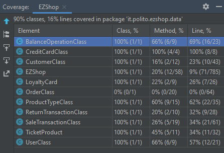
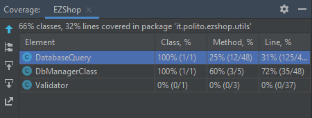
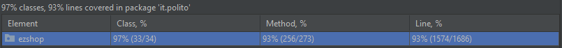
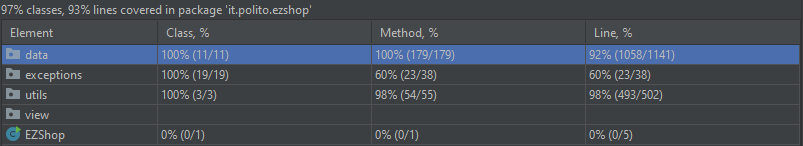
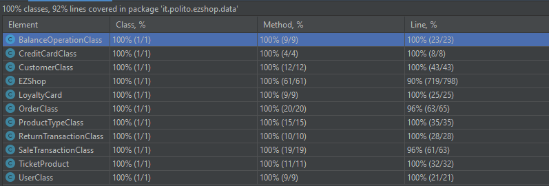
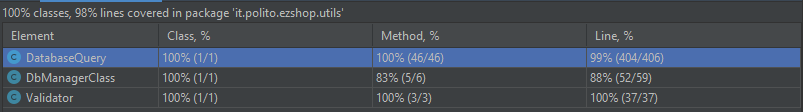

# Unit Testing Documentation

Authors: Teresa Torresani, Riccardo Ossella, Aurora Anna Pia Sergio, Antonio Macaluso

Date: 19/05/21

Version: 1.4 (26/06/21)

# Contents

- [Black Box Unit Tests](#black-box-unit-tests)

- [White Box Unit Tests](#white-box-unit-tests)

# Black Box Unit Tests

    <Define here criteria, predicates and the combination of predicates for each function of each class.
    Define test cases to cover all equivalence classes and boundary conditions.
    In the table, report the description of the black box test case and (traceability) the correspondence with the JUnit test case writing the 
    class and method name that contains the test case>
    <JUnit test classes must be in src/test/java/it/polito/ezshop   You find here, and you can use,  class TestEzShops.java that is executed  
    to start tests
    >

### **Class *CustomerClass* - method *setCustomerName***

**Criteria for method *setCustomerName*:**

- 'customerName' is empty
- 'customerName' is null

**Predicates for method *setCustomerName*:**

| Criteria | Predicate |
| -------- | --------- |
| 'customerName' is empty | T |
| | F |
| 'customerName' is null | T |
| | F |

**Boundaries**:

| Criteria | Boundary values |
| -------- | --------------- |

**Combination of predicates**:

| 'customerName' is empty | 'customerName' is null | Valid / Invalid | Description of the test case | JUnit test case |
|-------| --- | -------|-------|-------|
| F | F| Valid|cc = new CustomerClass(1, 230, "Antonio", "0000000001"); Setting a new name via **setCustomerName()** and getting the new value using **getCustomerName()** Checking the correctness of the output using **assertEquals** | **Class** CustomerClassTest,  **Method** testSetCustomerName
| F | T| Invalid|cc = new CustomerClass(1, 230, "Antonio", "0000000001"); Setting a null value via **setCustomerName()** and getting the new value using **getCustomerName()** Checking via **assertEquals** that the output hasn't been updated with the wrong value  | **Class** CustomerClassTest,  **Method** testSetCustomerName
| T | F| Invalid|cc = new CustomerClass(1, 230, "Antonio", "0000000001"); Setting an empty name value ("") via **setCustomerName()** and getting the new value using **getCustomerName()** Checking via **assertEquals** that the output hasn't been updated with the wrong value | **Class** CustomerClassTest,  **Method** testSetCustomerName

### **Class *CustomerClass* - method *setCustomerCard***

**Criteria for method *setCustomerCard*:**

- 'customerCard' is empty
- 'customerCard' is null
- 'customerCard' length is 10
- 'customerCard' contains only numeric characters

**Predicates for method *setCustomerCard*:**

| Criteria | Predicate |
| -------- | --------- |
| 'customerName' is empty | T |
| | F |
| 'customerName' is null | T |
| | F |
| 'customerCard' length is 10 | T |
| | F |
| 'customerCard' contains only numeric characters | T |
| | F |

**Boundaries**:

| Criteria | Boundary values |
| -------- | --------------- |

**Combination of predicates**:

| 'customerCard' is empty | 'customerCard' is null | 'customerCard' length is 10 | 'customerCard' contains only numeric characters | Valid / Invalid | Description of the test case | JUnit test case |
|-------| --- | --- | --- |-------|-------|-------|
| T | F | F | F | Invalid|cc = new CustomerClass(1, 230, "Antonio", "0000000001"); Setting an empty customerCard value ("") via **setCustomercard()** and getting the new value using **getCustomerCard()** Checking via **assertEquals** that the output hasn't been updated with the wrong value | **Class** CustomerClassTest, **Method** testSetCustomerCard
| F | T | F | F | Valid|cc = new CustomerClass(1, 230, "Antonio", "0000000001"); Setting a null customerCard value via **setCustomercard()** and getting the new value using **getCustomerCard()** Checking the correctness of the output using **assertEquals** (a null value indicates an user with no customerCard associated)| **Class** CustomerClassTest, **Method** testSetCustomerCard
| F | F | T | F | Invalid|cc = new CustomerClass(1, 230, "Antonio", "0000000001"); Setting a new customerCard with an invalid length via **setCustomercard()** and getting the new value using **getCustomerCard()** Checking via **assertEquals** that the output hasn't been updated with the wrong value | **Class** CustomerClassTest, **Method** testSetCustomerCard
| F | F | F | T | Invalid|cc = new CustomerClass(1, 230, "Antonio", "0000000001"); Setting a new customerCard with numeric characters only via **setCustomercard()** and getting the new value using **getCustomerCard()** Checking via **assertEquals** that the output hasn't been updated with the wrong value (the value has to be both alphanumeric and 10 characters long)| **Class** CustomerClassTest, **Method** testSetCustomerCard
| F | F | T | T | Valid|cc = new CustomerClass(1, 230, "Antonio", "0000000001"); Setting a new customerCard via **setCustomercard()** and getting the new value using **getCustomerCard()** Checking the correctness of the output using **assertEquals** | **Class** CustomerClassTest, **Method** testSetCustomerCard

### **Class *CustomerClass* - method *setId***

**Criteria for method *setId*:**

- 'id' value

**Predicates for method *setId*:**

| Criteria | Predicate |
| -------- | --------------- |
| 'id' value | (minint,0] |
| | (0, maxint)|

**Boundaries**:

| Criteria | Boundary values |
| -------- | --------------- |
| 'id' value | 0 |

**Combination of predicates**:

| 'id' value | Valid / Invalid | Description of the test case | JUnit test case |
|-------| -------|-------|-------|
|(minint,0]  |Invalid|cc = new CustomerClass(1, 230, "Antonio", "0000000001"); Setting a new ID via **setId()** and getting the new value using **getId()** Checking via **assertEquals** that the output hasn't been updated with the wrong value (the value has to be > 0) | **Class** CustomerClassTest,  **Method** testSetId
|(0, maxint) |Valid|cc = new CustomerClass(1, 230, "Antonio", "0000000001"); Setting a new ID via **setId()** and getting the new value using **getId()** Checking the correctness of the output using **assertEquals** | **Class** CustomerClassTest,  **Method** testSetId

### **Class *CustomerClass* - method *setPoints***

**Criteria for method *setPoints*:**

- 'points' value

**Predicates for method *setPoints*:**

| Criteria | Predicate |
| -------- | --------------- |
| 'points' value | (minint,0) |
| | [0, maxint)|

**Boundaries**:

| Criteria | Boundary values |
| -------- | --------------- |
| 'points' value | 0 |

**Combination of predicates**:

| Criteria | Predicate|  Valid / Invalid | Description of the test case | JUnit test case |
|-------| --- | -------|-------|-------|
|'points' value|[0, maxint)|Valid| cc = new CustomerClass(1, 230, "Antonio", "0000000001"); Setting a 'points' value via **setPoints()** and getting the new value using **getPoints()** Checking the correctness of the output using **assertEquals** | **Class** CustomerClassTest,  **Method** testSetPoints
|"|(minint,0)|Valid|cc = new CustomerClass(1, -20, "Antonio", "0000000001"); Getting the 'points' value using **getPoints()** Checking the correctness of the output using **assertEquals** (value must be defaulted to 0) | **Class** CustomerClassTest,  **Method** testPointsNotNegative

### **Class *LoyaltyCardTest* - method *addPoints***

**Criteria for method *addPoints*:**

- 'points' value

**Predicates for method *addPoints*:**

| Criteria | Predicate |
| -------- | --------- |
| 'points' value | (minint, maxint)

**Boundaries**:

| Criteria | Boundary values |
| -------- | --------------- |

**Combination of predicates**:

| 'points' value | Valid / Invalid | Description of the test case | JUnit test case |
|-------| -------|-------|-------|
|(minint, maxint)|Valid|lc = new LoyaltyCard("0000000001", 100, 1); Updating the 'points' value via **addPoints()** and getting the updated value using **getPoints()** Checking the correctness of the sum using **assertEquals** | **Class** LoyaltyCardTest,  **Method** testAddPoints

### **Class *LoyaltyCardTest* - method *setCardOwnerID***

**Criteria for method *setCardOwnerID*:**

- 'cardOwnerID' value

**Predicates for method *setCardOwnerID*:**

| Criteria | Predicate |
| -------- | --------- |
| 'cardOwnerID' value | (minint, maxint)

**Boundaries**:

| Criteria | Boundary values |
| -------- | --------------- |

**Combination of predicates**:

| 'cardOwnerID' value | Valid / Invalid | Description of the test case | JUnit test case |
|-------| -------|-------|-------|
|(minint, maxint)|Valid|lc = new LoyaltyCard("0000000001", 100, 1); Updating the 'cardOwnerID' value via **setCardOwnerID()** and getting the updated value using **getCardOwnerID** Checking the correctness of the sum using **assertEquals** | **Class** LoyaltyCardTest,  **Method** testSetCardOwnerID

**Boundaries**:

| Criteria | Boundary values |
| -------- | --------------- |

**Combination of predicates**:

| 'ID' is empty | 'ID' is null | Valid / Invalid | Description of the test case | JUnit test case |
|-------| --- | -------|-------|-------|
| F | F| Valid|lc = new LoyaltyCard("0000000001", 100, 1); Setting a new ID via **setID()** and getting the new value using **getID()** Checking the correctness of the output using **assertEquals** | **Class** LoyaltyCardTest,  **Method** testSetID
| F | T| Invalid|lc = new LoyaltyCard("0000000001", 100, 1); Setting a null value via **setID()** and getting the new value using **getID()** Checking via **assertEquals** that the output hasn't been updated with the wrong value  | **Class** LoyaltyCardTest,  **Method** testSetID
| T | F| Invalid|lc = new LoyaltyCard("0000000001", 100, 1); Setting an empty ID value ("") via **setID()** and getting the new value using **getID()** Checking via **assertEquals** that the output hasn't been updated with the wrong value | **Class** LoyaltyCardTest,  **Method** testSetID

### **Class *LoyaltyCardTest* - method *setPoints***

**Criteria for method *setPoints*:**

- 'points' value

**Predicates for method *setPoints*:**

| Criteria | Predicate |
| -------- | --------------- |
| 'points' value | (minint,0) |
| | [0, maxint)|

**Boundaries**:

| Criteria | Boundary values |
| -------- | --------------- |
| 'points' value | 0 |

**Combination of predicates**:

| Criteria | Predicate|  Valid / Invalid | Description of the test case | JUnit test case |
|-------| --- | -------|-------|-------|
|'points' value|[0, maxint)|Valid|lc = new LoyaltyCard("0000000001", 100, 1); Setting a 'points' value via **setPoints()** and getting the new value using **getPoints()** Checking the correctness of the output using **assertEquals** | **Class** LoyaltyCardTest,  **Method** testSetPoints
|"|(minint,0)|Valid|lc = new LoyaltyCard("0000000001", -100, 1); Getting the 'points' value using **getPoints()** Checking the correctness of the output using **assertEquals** (value must be defaulted to 0) | **Class** LoyaltyCardTest,  **Method** testPointsNotNegative

### **Class *LoyaltyCardTest* - method *setID***

**Criteria for method *setID*:**

- 'ID' is empty
- 'ID' is null
- 'ID' length is 10
- 'ID' contains only numeric characters

**Predicates for method *setID*:**

| Criteria | Predicate |
| -------- | --------- |
| 'ID' is empty | T |
| | F |
| 'ID' is null | T |
| | F |
| 'ID' length is 10 | T |
| | F |
| 'ID' contains only numeric characters | T |
| | F |

**Boundaries**:

| Criteria | Boundary values |
| -------- | --------------- |

**Combination of predicates**:

| 'ID' is empty | 'ID' is null | 'ID' length is 10 | 'ID' contains only numeric characters | Valid / Invalid | Description of the test case | JUnit test case |
|-------| --- | --- | --- |-------|-------|-------|
| T | F | F | F | Invalid|lc = new LoyaltyCard("0000000001", 100, 1); Setting an empty ("") 'ID' value via **setCardOwnerID()** and getting the new value using **getID()** Checking via **assertEquals** that the output hasn't been updated with the wrong value | **Class** LoyaltyCardTest,  **Method** testSetID
| F | T | F | F | Invalid|lc = new LoyaltyCard("0000000001", 100, 1); Setting a null 'ID' value via **setID()** and getting the new value using **getID()** Checking via **assertEquals** that the output hasn't been updated with the wrong value | **Class** LoyaltyCardTest,  **Method** testSetID
| F | F | T | F | Invalid|lc = new LoyaltyCard("0000000001", 100, 1); Setting a new ID with an invalid length via **setID()** and getting the new value using **getID()** Checking via **assertEquals** that the output hasn't been updated with the wrong value | **Class** LoyaltyCardTest,  **Method** testSetID
| F | F | F | T | Invalid|lc = new LoyaltyCard("0000000001", 100, 1); Setting a new ID with only numeric characters via **setID()** and getting the new value using **getID()** Checking via **assertEquals** that the output hasn't been updated with the wrong value (the value has to be both alphanumeric and 10 characters long)|  **Class** LoyaltyCardTest,  **Method** testSetID
| F | F | T | T |Valid|lc = new LoyaltyCard("0000000001", 100, 1); Setting a new ID via **setID()** and getting the new value using **getID()** Checking the correctness of the output using **assertEquals** | **Class** LoyaltyCardTest,  **Method** testSetID

### **Class *BalanceOperationClass* - method *setBalanceId***

**Criteria for method *setBalanceId*:**

- sign of 'balanceId'

**Predicates for method *setBalanceId*:**

| Criteria | Predicate |
| -------- | --------- |
| sign of 'balanceId' | [minint, 0)|
|          |  [0, maxint) |

**Boundaries**:

| Criteria | Boundary values |
| -------- | --------------- |
| sign of 'balanceId' |  0  |
|          |                 |

**Combination of predicates**:

| 'balanceId' < 0 | Valid / Invalid | Description of the test case | JUnit test case |
|-------|-------|-------|-------|
| yes | invalid|BalanceOperationClass b = new BalanceOperationClass(). Set a valid balanceId and check that it was correctly assigned. Try to set a balanceId < 0 and check that it has not changed (it still has the valid balanceId previously assigned).| testSetBalanceId()|||
| no | valid |BalanceOperationClass b = new BalanceOperationClass(). Set balanceId >= 0 and check that it was correctly assigned | testSetBalanceId()|||

### **Class *BalanceOperationClass* - method *setDate***

**Criteria for method *setDate*:**

- 'date' is null

**Predicates for method *setDate*:**

| Criteria | Predicate |
| -------- | --------- |
| | |

**Boundaries**:

| Criteria | Boundary values |
| -------- | --------------- |
| | |

**Combination of predicates**:

| date == null | Valid / Invalid | Description of the test case | JUnit test case |
|-------|-------|-------|-------|
| yes | invalid|BalanceOperationClass b = new BalanceOperationClass(). Set a valid date and check that it was correctly assigned. Try to set null as date and check that it has not changed (it still has the valid date previously assigned).| testSetDate()|||
| no | valid|BalanceOperationClass b = new BalanceOperationClass(). Set a valid date and check that it was correctly assigned| testSetDate()|||

### **Class *BalanceOperationClass* - method *setMoney***

**Criteria for method *setMoney*:**

- sign of 'money'

**Predicates for method *setMoney*:**

| Criteria | Predicate |
| -------- | --------- |
| sign of 'money' | (double) [minint, 0) |
| sign of 'money' | (double) [0, maxint) |

**Boundaries**:

| Criteria | Boundary values |
| -------- | --------------- |
| sign of 'money' | 0.0 |

**Combination of predicates**:

| money < 0 | Valid / Invalid | Description of the test case | JUnit test case |
|-------|-------|-------|-------|
| yes | invalid|BalanceOperationClass b = new BalanceOperationClass(). Set a 'money' value >= 0 and check that it was correctly assigned. Try to set a negative value for 'money' and check that it has not changed (it still has the valid value previously assigned).| testSetMoney()|||
| no | valid|BalanceOperationClass b = new BalanceOperationClass(). Set a 'money' value >= 0 and check that it was correctly assigned| testSetMoney()|||

### **Class *BalanceOperationClass* - method *setType***

**Criteria for method *setType*:**

- 'type' is null
- 'type' is an empty string

**Predicates for method *setType*:**

| Criteria | Predicate |
| -------- | --------- |
| | |

**Boundaries**:

| Criteria | Boundary values |
| -------- | --------------- |
| | |

**Combination of predicates**:

| type == null | type == "" | Valid / Invalid | Description of the test case | JUnit test case |
|-------|-------|-------|-------|-------|
| yes | no | invalid|BalanceOperationClass b = new BalanceOperationClass(). Set a valid type and check that it was correctly assigned. Try to set null as type and check that it has not changed (it still has the valid type previously assigned).| testSetType()|||
| no | yes | invalid|BalanceOperationClass b = new BalanceOperationClass(). Set a valid type and check that it was correctly assigned. Try to set an empty string as type and check that it has not changed (it still has the valid type previously assigned).| testSetType()|||
| no | no | valid|BalanceOperationClass b = new BalanceOperationClass(). Set a valid type and check that it was correctly assigned| testSetType()|||

### **Class *OrderClass* - method *setBalanceId***

**Criteria for method *setBalanceId*:**

- 'balanceId' is null
- sign of 'balanceId'

**Predicates for method *setBalanceId*:**

| Criteria | Predicate |
| -------- | --------- |
| sign of 'balanceId' | [minint, 0)|
|          |  [0, maxint) |

**Boundaries**:

| Criteria | Boundary values |
| -------- | --------------- |
| sign of 'balanceId' |  0  |
|          |                 |

**Combination of predicates**:

| 'balanceId' < 0 | 'balanceId' == null | Valid / Invalid | Description of the test case | JUnit test case |
|-------|-------|-------|-------|-------|
| yes | no| invalid|OrderClass o = new OrderClass(...). Set a valid balanceId and check that it was correctly assigned. Try to set a balanceId < 0 and check that it has not changed (it still has the valid balanceId previously assigned).| testSetBalanceId()|||
| * | yes | invalid|OrderClass o = new OrderClass(...). Set a valid balanceId and check that it was correctly assigned. Try to set null as balanceId and check that it has not changed (it still has the valid balanceId previously assigned).| testSetBalanceId()|||
| no | no | valid  |OrderClass o = new OrderClass(...). Set balanceId >= 0 and check that it was correctly assigned | testSetBalanceId()|||

### **Class *OrderClass* - method *setDate***

**Criteria for method *setDate*:**

- 'date' is null

**Predicates for method *setDate*:**

| Criteria | Predicate |
| -------- | --------- |
| | |

**Boundaries**:

| Criteria | Boundary values |
| -------- | --------------- |
| | |

**Combination of predicates**:

| date == null | Valid / Invalid | Description of the test case | JUnit test case |
|-------|-------|-------|-------|
| yes | invalid|OrderClass o = new OrderClass(). Set a valid date and check that it was correctly assigned. Try to set null as date and check that it has not changed (it still has the valid date previously assigned).| testSetDate()|||
| no |  valid  |OrderClass o = new OrderClass(). Set a valid date and check that it was correctly assigned| testSetDate()|||

### **Class *OrderClass* - method *setMoney***

**Criteria for method *setMoney*:**

- sign of 'money'

**Predicates for method *setMoney*:**

| Criteria | Predicate |
| -------- | --------- |
| sign of 'money' | (double) [minint, 0) |
| sign of 'money' | (double) [0, maxint) |

**Boundaries**:

| Criteria | Boundary values |
| -------- | --------------- |
| sign of 'money' | 0.0 |

**Combination of predicates**:

| money < 0 | Valid / Invalid | Description of the test case | JUnit test case |
|-------|-------|-------|-------|
| yes | invalid|OrderClass o = new OrderClass(). Set a 'money' value >= 0 and check that it was correctly assigned. Try to set a negative value for 'money' and check that it has not changed (it still has the valid value previously assigned).| testSetMoney()|||
| no | valid   |OrderClass o = new OrderClass(). Set a 'money' value >= 0 and check that it was correctly assigned| testSetMoney()|||

### **Class *OrderClass* - method *setType***

**Criteria for method *setType*:**

- 'type' is null
- 'type' is an empty string

**Predicates for method *setType*:**

| Criteria | Predicate |
| -------- | --------- |
| | |

**Boundaries**:

| Criteria | Boundary values |
| -------- | --------------- |
| | |

**Combination of predicates**:

| type == null | type == "" | Valid / Invalid | Description of the test case | JUnit test case |
|-------|-------|-------|-------|-------|
| yes | no | invalid|OrderClass o = new OrderClass(). Set a valid type and check that it was correctly assigned. Try to set null as type and check that it has not changed (it still has the valid type previously assigned).| testSetType()|||
| no | yes | invalid|OrderClass o = new OrderClass(). Set a valid type and check that it was correctly assigned. Try to set an empty string as type and check that it has not changed (it still has the valid type previously assigned).| testSetType()|||
| no | no  |  valid |OrderClass o = new OrderClass(). Set a valid type and check that it was correctly assigned| testSetType()|||

### **Class *OrderClass* - method *setOrderId***

**Criteria for method *setOrderId*:**

- 'orderId' is null
- sign of 'orderId'

**Predicates for method *setOrderId*:**

| Criteria | Predicate |
| -------- | --------- |
| sign of 'orderId' | [minint, 0)|
|          |  [0, maxint) |

**Boundaries**:

| Criteria | Boundary values |
| -------- | --------------- |
| sign of 'orderId' |  0  |
|          |                 |

**Combination of predicates**:

| 'orderId' < 0 | 'orderId' == null | Valid / Invalid | Description of the test case | JUnit test case |
|-------|-------|-------|-------|-------|
| yes | no| invalid|OrderClass o = new OrderClass(...). Set a valid orderId and check that it was correctly assigned. Try to set a orderId < 0 and check that it has not changed (it still has the valid orderId previously assigned).| testSetOrderId()|||
| * | yes | invalid|OrderClass o = new OrderClass(...). Set a valid orderId and check that it was correctly assigned. Try to set null as orderId and check that it has not changed (it still has the valid orderId previously assigned).| testSetOrderId()|||
| no | no | valid  |OrderClass o = new OrderClass(...). Set orderId >= 0 and check that it was correctly assigned | testSetOrderId()|||

### **Class *OrderClass* - method *setStatus***

**Criteria for method *setStatus*:**

- 'status' is null
- 'status' is an empty string

**Predicates for method *setStatus*:**

| Criteria | Predicate |
| -------- | --------- |
| | |

**Boundaries**:

| Criteria | Boundary values |
| -------- | --------------- |
| | |

**Combination of predicates**:

| status == null | status == "" | Valid / Invalid | Description of the test case | JUnit test case |
|-------|-------|-------|-------|-------|
| yes | no | invalid|OrderClass o = new OrderClass(). Set a valid status and check that it was correctly assigned. Try to set null as status and check that it has not changed (it still has the valid status previously assigned).| testSetStatus()|||
| no | yes | invalid|OrderClass o = new OrderClass(). Set a valid status and check that it was correctly assigned. Try to set an empty string as status and check that it has not changed (it still has the valid status previously assigned).| testSetStatus()|||
| no | no  |  valid |OrderClass o = new OrderClass(). Set a valid status and check that it was correctly assigned| testSetStatus()|||

### **Class *OrderClass* - method *setProductCode***

**Criteria for method *setProductCode*:**

- 'productCode' is null
- 'productCode' is an empty string

**Predicates for method *setProductCode*:**

| Criteria | Predicate |
| -------- | --------- |
| | |

**Boundaries**:

| Criteria | Boundary values |
| -------- | --------------- |
| | |

**Combination of predicates**:

| productCode == null | productCode == "" | Valid / Invalid | Description of the test case | JUnit test case |
|-------|-------|-------|-------|-------|
| yes | no | invalid|OrderClass o = new OrderClass(). Set a valid productCode and check that it was correctly assigned. Try to set null as productCode and check that it has not changed (it still has the valid productCode previously assigned).| testSetProductCode()|||
| no | yes | invalid|OrderClass o = new OrderClass(). Set a valid productCode and check that it was correctly assigned. Try to set an empty string as productCode and check that it has not changed (it still has the valid productCode previously assigned).| testSetProductCode()|||
| no | no  |  valid |OrderClass o = new OrderClass(). Set a valid productCode and check that it was correctly assigned| testSetProductCode()|||

### **Class *OrderClass* - method *setPricePerUnit***

**Criteria for method *setPricePerUnit*:**

- sign of 'pricePerUnit'

**Predicates for method *setPricePerUnit*:**

| Criteria | Predicate |
| -------- | --------- |
| sign of 'pricePerUnit' | (double) [minint, 0) |
| sign of 'pricePerUnit' | (double) [0, maxint) |

**Boundaries**:

| Criteria | Boundary values |
| -------- | --------------- |
| sign of 'pricePerUnit' | 0.0 |

**Combination of predicates**:

| pricePerUnit < 0 | Valid / Invalid | Description of the test case | JUnit test case |
|-------|-------|-------|-------|
| yes | invalid|OrderClass o = new OrderClass(). Set a 'pricePerUnit' value >= 0 and check that it was correctly assigned. Try to set a negative value for 'pricePerUnit' and check that it has not changed (it still has the valid value previously assigned).| testSetPricePerUnit()|||
| no | valid   |OrderClass o = new OrderClass(). Set a 'pricePerUnit' value >= 0 and check that it was correctly assigned|testSetPricePerUnit()|||

### **Class *OrderClass* - method *setQuantity***

**Criteria for method *setQuantity*:**

- sign of 'quantity'

**Predicates for method *setQuantity*:**

| Criteria | Predicate |
| -------- | --------- |
| sign of 'quantity' |[minint, 0) |
| sign of 'quantity' |[0, maxint) |

**Boundaries**:

| Criteria | Boundary values |
| -------- | --------------- |
| sign of 'quantity' | 0 |

**Combination of predicates**:

| quantity < 0 | Valid / Invalid | Description of the test case | JUnit test case |
|-------|-------|-------|-------|
| yes | invalid|OrderClass o = new OrderClass(). Set a 'quantity' value >= 0 and check that it was correctly assigned. Try to set a negative value for 'quantity' and check that it has not changed (it still has the valid value previously assigned).| testSetQuantity()|||
| no | valid   |OrderClass o = new OrderClass(). Set a 'quantity' value >= 0 and check that it was correctly assigned|testSetQuantity()|||

### **Class *TicketProduct* - method *setBarCode***

**Criteria for method *setBarCode*:**

- 'barCode' is null
- 'barCode' is an empty string

**Predicates for method *setBarCode*:**

| Criteria | Predicate |
| -------- | --------- |
| | |

**Boundaries**:

| Criteria | Boundary values |
| -------- | --------------- |
| | |

**Combination of predicates**:

| barCode == null | barCode == "" | Valid / Invalid | Description of the test case | JUnit test case |
|-------|-------|-------|-------|-------|
| yes | no | invalid|TicketProduct tp = new TicketProduct(). Set a valid barCode and check that it was correctly assigned. Try to set null as barCode and check that it has not changed (it still has the valid barCode previously assigned).| testSetBarCode()|||
| no | yes | invalid|TicketProduct tp = new TicketProduct(). Set a valid barCode and check that it was correctly assigned. Try to set an empty string as barCode and check that it has not changed (it still has the valid barCode previously assigned).| testSetBarCode()|||
| no | no  |  valid |TicketProduct tp = new TicketProduct(). Set a valid barCode and check that it was correctly assigned| testSetBarCode()|||

### **Class *TicketProduct* - method *setProductDescription***

**Criteria for method *setProductDescription*:**

- 'productDescription' is null
- 'productDescription' is an empty string

**Predicates for method *setProductDescription*:**

| Criteria | Predicate |
| -------- | --------- |
| | |

**Boundaries**:

| Criteria | Boundary values |
| -------- | --------------- |
| | |

**Combination of predicates**:

| productDescription == null | productDescription == "" | Valid / Invalid | Description of the test case | JUnit test case |
|-------|-------|-------|-------|-------|
| yes | no | invalid|TicketProduct tp = new TicketProduct(). Set a valid productDescription and check that it was correctly assigned. Try to set null as productDescription and check that it has not changed (it still has the valid productDescription previously assigned).| testSetProductDescription()|||
| no | yes | invalid|TicketProduct tp = new TicketProduct(). Set a valid productDescription and check that it was correctly assigned. Try to set an empty string as productDescription and check that it has not changed (it still has the valid productDescription previously assigned).| testSetProductDescription()|||
| no | no  |  valid |TicketProduct tp = new TicketProduct(). Set a valid productDescription and check that it was correctly assigned| testSetProductDescription()|||

### **Class *TicketProduct* - method *setPricePerUnit***

**Criteria for method *setPricePerUnit*:**

- sign of 'pricePerUnit'

**Predicates for method *setPricePerUnit*:**

| Criteria | Predicate |
| -------- | --------- |
| sign of 'pricePerUnit' | (double) [minint, 0) |
| sign of 'pricePerUnit' | (double) [0, maxint) |

**Boundaries**:

| Criteria | Boundary values |
| -------- | --------------- |
| sign of 'pricePerUnit' | 0.0 |

**Combination of predicates**:

| pricePerUnit < 0 | Valid / Invalid | Description of the test case | JUnit test case |
|-------|-------|-------|-------|
| yes | invalid|TicketProduct tp = new TicketProduct(). Set a 'pricePerUnit' value >= 0 and check that it was correctly assigned. Try to set a negative value for 'pricePerUnit' and check that it has not changed (it still has the valid value previously assigned).| testSetPricePerUnit()|||
| no | valid   |TicketProduct tp = new TicketProduct(). Set a 'pricePerUnit' value >= 0 and check that it was correctly assigned|testSetPricePerUnit()|||

### **Class *TicketProduct* - method *setAmount***

**Criteria for method *setAmount*:**

- sign of 'amount'

**Predicates for method *setAmount*:**

| Criteria | Predicate |
| -------- | --------- |
| sign of 'amount' |[minint, 0) |
| sign of 'amount' |[0, maxint) |

**Boundaries**:

| Criteria | Boundary values |
| -------- | --------------- |
| sign of 'amount' | 0 |

**Combination of predicates**:

| amount < 0 | Valid / Invalid | Description of the test case | JUnit test case |
|-------|-------|-------|-------|
| yes | invalid|TicketProduct tp = new TicketProduct(). Set an 'amount' value >= 0 and check that it was correctly assigned. Try to set a negative value for 'amount' and check that it has not changed (it still has the valid value previously assigned).| testSetAmount()|||
| no | valid   |TicketProduct tp = new TicketProduct(). Set an 'amount' value >= 0 and check that it was correctly assigned|testSetAmount()|||

### **Class *TicketProduct* - method *setDiscountRate***

**Criteria for method *setDiscountRate*:**

- sign of 'discountRate'
- 'discountRate' less than 1

**Predicates for method *setDiscountRate*:**

| Criteria | Predicate |
| -------- | --------- |
| sign of 'discountRate' | (double) [minint, 0) |
| sign of 'discountRate' | (double) [0, maxint) |
| 'discountRate' less than 1 | (double) [0, 1) |
| 'discountRate' less than 1 | (double) [1, maxint) |

**Boundaries**:

| Criteria | Boundary values |
| -------- | --------------- |
| sign of 'discountRate' | 0.0 |
| 'discountRate' less than 1| 1.0 |

**Combination of predicates**:

| discountRate < 0 | discountRate < 1 | Valid / Invalid | Description of the test case | JUnit test case |
|-------|-------|-------|-------|-------|
| yes | yes | invalid |TicketProduct tp = new TicketProduct(). Set a 'discountRate' value (>= 0 && < 1) and check that it was correctly assigned. Try to set a negative value for 'discountRate' and check that it has not changed (it still has the valid value previously assigned).| testSetDiscountRate()|||
| no  | no  | invalid |TicketProduct tp = new TicketProduct(). Set a 'discountRate' value (>= 0 && < 1) and check that it was correctly assigned.  Try to set a value for 'discountRate' >= 1 and check that it has not changed (it still has the valid value previously assigned).|testSetDiscountRate()|||
| no  | yes   | valid |TicketProduct tp = new TicketProduct(). Set a 'discountRate' value (>= 0 && < 1) and check that it was correctly assigned|testSetDiscountRate()|||

### **Class *CreditCardClass* - method *setCardCredit***

**Criteria for method *setCardCredit*:**

- 'credit' value

**Predicates for method *setCardCredit*:**

| Criteria | Predicate |
| -------- | --------------- |
| 'credit' value | (mindouble,0) |
| | [0, maxdouble)|

**Boundaries**:

| Criteria | Boundary values |
| -------- | --------------- |
| 'credit' value | 0 |

**Combination of predicates**:

| 'credit' value | Valid / Invalid | Description of the test case | JUnit test case |
|-------| -------|-------|-------|
| (mindouble,0) |Invalid|CreditCardClass cc = new CreditCardClass("123456789012"); Setting a new credit via **setCardCredit()** and getting the new value using **getCardCredit()** Checking via **assertEquals** that the output has been updated with the wrong value (the value has to be >= 0) | **Class** CreditCardClassTest,  **Method** testSetCardCredit
| [0, maxdouble) |Valid|CreditCardClass cc = new CreditCardClass("123456789012"); Setting a new credit via **setCardCredit()** and getting the new value using **getCardCredit()** Checking the correctness of the output using **assertEquals** | **Class** CreditCardClassTest,  **Method** testSetCardCredit
----

### **Class *ReturnTransactionClass* - method *addProduct***

**Criteria for method *addProduct*:**

**Predicates for method *addProduct*:**

| Criteria | Predicate |
| -------- | --------- |

**Boundaries**:

| Criteria | Boundary values |
| -------- | --------------- |

**Combination of predicates**:

| Valid / Invalid | Description of the test case | JUnit test case |
|-------|-------|-------|
| Valid |         ReturnTransactionClass returnTransactionClass = new ReturnTransactionClass(666); Checks the product list to be not null  Checks the product list to be not empty.  Adds a product with .addProduct(10099,1);  Checks that product list is not empty.  Checks that product list has 1 value.  Adds another product with .addProduct(10099,1);  Checks that the product list length is still 1. Checks the product entry | **class**  ReturnTransactionClassTest  **method** testAddProduct() |
**Predicates for method *setDiscountRate*:**

| Criteria | Predicate |
| -------- | --------- |
| sign of 'discountRate' | (double) [minint, 0) |
| sign of 'discountRate' | (double) [0, maxint) |
| 'discountRate' less than 1 | (double) [0, 1) |
| 'discountRate' less than 1 | (double) [1, maxint) |

**Boundaries**:

| Criteria | Boundary values |
| -------- | --------------- |
| sign of 'discountRate' | 0.0 |
| 'discountRate' less than 1| 1.0 |

**Combination of predicates**:

| discountRate < 0 | discountRate < 1 | Valid / Invalid | Description of the test case | JUnit test case |
|-------|-------|-------|-------|-------|
| yes | yes | invalid |TicketProduct tp = new TicketProduct(). Set a 'discountRate' value (>= 0 && < 1) and check that it was correctly assigned. Try to set a negative value for 'discountRate' and check that it has not changed (it still has the valid value previously assigned).| testSetDiscountRate()|||
| no  | no  | invalid |TicketProduct tp = new TicketProduct(). Set a 'discountRate' value (>= 0 && < 1) and check that it was correctly assigned.  Try to set a value for 'discountRate' >= 1 and check that it has not changed (it still has the valid value previously assigned).|testSetDiscountRate()|||
| no  | yes   | valid |TicketProduct tp = new TicketProduct(). Set a 'discountRate' value (>= 0 && < 1) and check that it was correctly assigned|testSetDiscountRate()|||

### **Class *ReturnTransactionClass* - method *addProduct***

**Criteria for method *addProduct*:**

**Predicates for method *addProduct*:**

| Criteria | Predicate |
| -------- | --------- |

**Boundaries**:

| Criteria | Boundary values |
| -------- | --------------- |

**Combination of predicates**:

| Valid / Invalid | Description of the test case | JUnit test case |
|-------|-------|-------|
| Valid |         ReturnTransactionClass returnTransactionClass = new ReturnTransactionClass(666); Checks the product list to be not null  Checks the product list to be not empty.  Adds a product with .addProduct(10099,1);  Checks that product list is not empty.  Checks that product list has 1 value.  Adds another product with .addProduct(10099,1);  Checks that the product list length is still 1. Checks the product entry | **class**  ReturnTransactionClassTest  **method** testAddProduct() |

### **Class *ReturnTransactionClass* - method *addProduct***

**Criteria for method *addProduct*:**

**Predicates for method *addProduct*:**

| Criteria | Predicate |
| -------- | --------- |

**Boundaries**:

| Criteria | Boundary values |
| -------- | --------------- |

**Combination of predicates**:

| Valid / Invalid | Description of the test case | JUnit test case |
|-------|-------|-------|
| Valid |         ReturnTransactionClass returnTransactionClass = new ReturnTransactionClass(666); Checks the product list to be not null  Checks the product list to be not empty.  Adds a product with .addProduct(10099,1);  Checks that product list is not empty.  Checks that product list has 1 value.  Adds another product with .addProduct(10099,1);  Checks that the product list length is still 1. Checks the product entry | **class**  ReturnTransactionClassTest  **method** testAddProduct() |
**Predicates for method *setDiscountRate*:**

| Criteria | Predicate |
| -------- | --------- |
| sign of 'discountRate' | (double) [minint, 0) |
| sign of 'discountRate' | (double) [0, maxint) |
| 'discountRate' less than 1 | (double) [0, 1) |
| 'discountRate' less than 1 | (double) [1, maxint) |

**Boundaries**:

| Criteria | Boundary values |
| -------- | --------------- |
| sign of 'discountRate' | 0.0 |
| 'discountRate' less than 1| 1.0 |

**Combination of predicates**:

| discountRate < 0 | discountRate < 1 | Valid / Invalid | Description of the test case | JUnit test case |
|-------|-------|-------|-------|-------|
| yes | yes | invalid |TicketProduct tp = new TicketProduct(). Set a 'discountRate' value (>= 0 && < 1) and check that it was correctly assigned. Try to set a negative value for 'discountRate' and check that it has not changed (it still has the valid value previously assigned).| testSetDiscountRate()|||
| no  | no  | invalid |TicketProduct tp = new TicketProduct(). Set a 'discountRate' value (>= 0 && < 1) and check that it was correctly assigned.  Try to set a value for 'discountRate' >= 1 and check that it has not changed (it still has the valid value previously assigned).|testSetDiscountRate()|||
| no  | yes   | valid |TicketProduct tp = new TicketProduct(). Set a 'discountRate' value (>= 0 && < 1) and check that it was correctly assigned|testSetDiscountRate()|||

### **Class *ReturnTransactionClass* - method *setClosed***

**Criteria for method *setClosed*:**

**Predicates for method *setClosed*:**

| Criteria | Predicate |
| -------- | --------- |

**Boundaries**:

| Criteria | Boundary values |
| -------- | --------------- |

**Combination of predicates**:

| Valid / Invalid | Description of the test case | JUnit test case |
|-------|-------|-------|
| Valid |    Create new class with         ReturnTransactionClass returnTransactionClass = new ReturnTransactionClass(11);  Check that is not closed.  Set transaction closed.  Check that is now closed.  Set transaction not closed.  Check transaction not closed. | **class**  ReturnTransactionClassTest  **method** testSetClosed() |

### **Class *ReturnTransactionClass* - method *setPayed***

**Criteria for method *setPayed*:**

**Predicates for method *setPayed*:**

| Criteria | Predicate |
| -------- | --------- |

**Boundaries**:

| Criteria | Boundary values |
| -------- | --------------- |

**Combination of predicates**:

| Valid / Invalid | Description of the test case | JUnit test case |
|-------|-------|-------|
| Valid |    Create new class with         ReturnTransactionClass returnTransactionClass = new ReturnTransactionClass(11);  Check that is not closed.  Set transaction closed.  Check that is now closed.  Set transaction not closed.  Check transaction not closed. | **class**  ReturnTransactionClassTest  **method** testAddProduct() |

### **Class *Validator* - method *checkBarCode***

**Criteria for method *checkBarCode*:**

- 'barCode' is GTIN-12
- 'barCode' is GTIN-13
- 'barCode' is GTIN-14

**Predicates for method *setBarCode*:**

| Criteria | Predicate |
| -------- | --------- |
| 'barCode' is GTIN-12 | T |
| | F |
| 'barCode' is GTIN-13 | T |
| | F |
| 'barCode' is GTIN-14 | T |
| | F |

**Boundaries**:

| Criteria | Boundary values |
| -------- | --------------- |

**Combination of predicates**:

| 'barCode' is GTIN-12/13/14 |   Valid / Invalid | Description of the test case | JUnit test case |
|-------|  -------|-------|-------|
|T|  Valid|String barCode= "123456789012"; Checking a barCode via **checkBarCode()**  Checking the correctness of the output using **assertTrue** | **Class** ValidatorTest,  **Method** testCheckBarCode
|F| Invalid|String barCode= "1234567890127"; Checking a barCode via **checkBarCode()**  Checking the correctness of the output using **assertFalse** | **Class** ValidatorTest,  **Method** testCheckBarCode
-------

### **Class *Validator* - method *checkPositionFormat***

**Criteria for method *checkPositionFormat*:**

- 'position' format is <aisleNumber>-<rackAlphabeticIdentifier>-<levelNumber>

**Predicates for method *checkPositionFormat*:**

| Criteria | Predicate |
| -------- | --------- |
| 'position' format is <aisleNumber>-<rackAlphabeticIdentifier>-<levelNumber> | T |
| | F |

**Boundaries**:

| Criteria | Boundary values |
| -------- | --------------- |

**Combination of predicates**:

| 'position' has valid format |  Valid / Invalid | Description of the test case | JUnit test case |
|-------| -------|-------|-------|
|T| Valid|String pos = "2-tt-9"; Checking a barCode via **checkPositionFormat()**  Checking the correctness of the output using **assertTrue** | **Class** ValidatorTest,  **Method** testCheckPositionFormat
|F| Invalid|String pos = "2-t-2-q"; Checking a barCode via **checkPositionFormat()**  Checking the correctness of the output using **assertFalse** | **Class** ValidatorTest,  **Method** testCheckPositionFormat
-------

### **Class *Validator* - method *testCheckCreditCard***

**Criteria for method *testCheckCreditCard*:**

- 'creditCardNumber' follows the luhn algorithm

**Predicates for method *testCheckCreditCard*:**

| Criteria | Predicate |
| -------- | --------- |
| 'creditCardNumber' follows the luhn algorithm| T |
| | F |

**Boundaries**:

| Criteria | Boundary values |
| -------- | --------------- |

**Combination of predicates**:

| 'creditCardNumber' follows the luhn algorithm |  Valid / Invalid | Description of the test case | JUnit test case |
|-------| -------|-------|-------|
|T|  Valid|String cardNo = "4716258050958645"; Checking a creditCardNumber via **checkCreditCard()**  Checking the correctness of the output using **assertTrue** | **Class** ValidatorTest,  **Method** testCheckCreditCard
|F| Invalid|cardNo = "12345678912345"; Checking a creditCardNumber via **checkCreditCard()**  Checking the correctness of the output using **assertFalse** | **Class** ValidatorTest,  **Method** testCheckCreditCard
-------

**UPDATE [12/06]** Testing the new Product Class

### **Class *Product* - method *setRfid***

**Criteria for method *setRfid*:**

- 'rfid' is empty
- 'rfid' is null
- Long.parseLong(rfid) value

**Predicates for method *setRfid*:**

| Criteria | Predicate |
| -------- | --------- |
| 'rfid' is empty | T |
| | F |
| 'rfid' is null | T |
| | F |
| Long.parseLong(rfid) value | (minlong, 0) |
| | [0, maxlong)  |

**Boundaries**:

| Criteria | Boundary values |
| -------- | --------------- |
| Long.parseLong(rfid) value| 0 |

**Combination of predicates**:

| 'rfid' is empty | 'rfid' is null | Long.parseLong(rfid) value | Valid / Invalid | Description of the test case | JUnit test case |
|-------| -------|-------|----- | ----- | ----- |
| T | * | * | Invalid | Filling the RFID linked to a product with an empty value using **setRfid()**   Getting the new value using **getRfid()** Checking via **assertEquals** that the output has not been updated with the wrong value (the value cannot be empty) | **Class** ProductTest,  **Method** testSetRfid
| * | T | * | Invalid |  Filling the RFID linked to a product with a null value using **setRfid()**   Getting the new value using **getRfid()** Checking via **assertEquals** that the output has not been updated with the wrong value (the value cannot be null) | **Class** ProductTest,  **Method** testSetRfid
| * | * | (minlong, 0) | Invalid |  Filling the RFID linked to a product with a negative value using **setRfid()**   Getting the new value using **getRfid()** Checking via **assertEquals** that the output has not been updated with the wrong value (the value has to be >= 0) | **Class** ProductTest,  **Method** testSetRfid
| F | F | [0, maxlong) | Valid |  Filling the RFID linked to a product with a value >= 0 using **setRfid()**   Getting the new value using **getRfid()** Checking via **assertEquals** that the output has been updated with the new value | **Class** ProductTest,  **Method** testSetRfid;

### **Class *Product* - method *setProductCode***

**Criteria for method *setProductCode*:**

- 'productCode' is empty
- 'productCode' is null

**Predicates for method *setProductCode*:**

| Criteria | Predicate |
| -------- | --------- |
| 'productCode' is empty | T |
| | F |
| 'productCode' is null | T |
| | F |

**Boundaries**:

| Criteria | Boundary values |
| -------- | --------------- |

**Combination of predicates**:

| 'productCode' is empty | 'productCode' is null  | Valid / Invalid | Description of the test case | JUnit test case |
|-------| -------|------- | ----- | ----- |
| T | * | Invalid | Filling the productCode linked to a product with an empty value using **setRfid()**   Getting the new value using **getProductCode()** Checking via **assertEquals** that the output has not been updated with the wrong value (the value cannot be empty) | **Class** ProductTest,  **Method** testSetProductCode;
| * | T | Invalid |  Filling the productCode linked to a product with a null value using **setRfid()**   Getting the new value using **getProductCode()** Checking via **assertEquals** that the output has not been updated with the wrong value (the value cannot be null) | **Class** ProductTest,  **Method** testSetProductCode;
| F | F | Valid |  Filling the productCode linked to a product with a value >= 0 using **setRfid()**   Getting the new value using **getProductCode()** Checking via **assertEquals** that the output has been updated with the new value | **Class** ProductTest,  **Method** testSetProductCode;

### **Class *Product* - method *setStatus***

**Criteria for method *setStatus*:**

- 'status' value is "STAT_INV"
- 'status' value is "STAT_SOLD"
- 'status' value is "STAT_RET"
 
**Predicates for method *setStatus*:**

| Criteria | Predicate |
| -------- | --------- |
| 'status' value is "STAT_INV" | T |
| | F |
| 'status' value is "STAT_SOLD" | T |
| | F |
| 'status' value is "STAT_RET" | T |
| | F |

**Boundaries**:

| Criteria | Boundary values |
| -------- | --------------- |

**Combination of predicates**:

| 'status' value is "STAT_INV" | 'status' value is "STAT_SOLD" | 'status' value is "STAT_RET" | Valid / Invalid | Description of the test case | JUnit test case |
|-------| -------|------- | ---- | ----- | ----- |
| T | F | F | Valid | Using checkStatus() to look up the 'status' value   Getting the new value using **getStatus()** Checking via **assertEquals** that the output has been updated with the new value  | **Class** ProductTest,  **Method** testSetStatus;
| F | T | F | Valid | Using checkStatus() to look up the 'status' value   Getting the new value using **getStatus()** Checking via **assertEquals** that the output has been updated with the new value  | **Class** ProductTest,  **Method** testSetStatus;
| F | F | T | Valid | Using checkStatus() to look up the 'status' value   Getting the new value using **getStatus()** Checking via **assertEquals** that the output has been updated with the new value  | **Class** ProductTest,  **Method** testSetStatus;
| F | F | F | Invalid |  using checkStatus() to look up the 'status' value   Getting the new value using **getStatus()** Checking via **assertEquals** that the output has not been updated with the wrong value | **Class** ProductTest,  **Method** testSetStatus;

### **Class *Product* - method *setStatus* **

**Predicates for method *setStatus*:**

| Criteria | Predicate |
| -------- | --------- |
| 'status' is empty | T |
| | F |
| 'status' is null | T |
| | F |
| checkStatus return value | T |
| | F  |

**Boundaries**:

| Criteria | Boundary values |
| -------- | --------------- |

**Combination of predicates**:

| 'status' is empty | 'status' is null | checkStatus return value | Valid / Invalid | Description of the test case | JUnit test case |
|-------| -------|-------|----- | ----- | ----- |
| T | F | * | Invalid | Filling the 'status' variable with an empty value using **setStatus()**   Getting the new value using **getStatus()** Checking via **assertEquals** that the output has not been updated with the wrong value (the value cannot be empty) | **Class** ProductTest,  **Method** testSetStatus
| F | T | * | Invalid | Filling the 'status' variable with a null value using **setStatus()**   Getting the new value using **getStatus()** Checking via **assertEquals** that the output has not been updated with the wrong value (the value cannot be null) | **Class** ProductTest,  **Method** testSetStatus
| F | F | F | Invalid | Filling the 'status' variable with a negative value using **setStatus()**   Getting the new value using **getStatus()** Checking via **assertEquals** that the output has not been updated with the wrong value (checkStatus must be true) | **Class** ProductTest,  **Method** testSetStatus
| F | F | T | Valid |  Filling the 'status' variable with a not empty, not null value validated by checkStatus() using **setStatus()**   Getting the new value using **getStatus()** Checking via **assertEquals** that the output has been updated with the new value | **Class** ProductTest,  **Method** testSetStatus

-------

# White Box Unit Tests

### Test cases definition
    
    <JUnit test classes must be in src/test/java/it/polito/ezshop>
    <Report here all the created JUnit test cases, and the units/classes under test >
    <For traceability write the class and method name that contains the test case>

| Unit name | JUnit test case |
|-----------|-----------------|
| Method checkBarCode() | testCheckBarCode |
| Method checkPositionFormat() | checkPositionFormat |
| Method checkCreditCard() | testCheckCreditCard |

### Code coverage report

- Based on the last valid commit from 20/05

- We are improving these percentages on the upcoming deadline (Integration testing): it will cover the missing methods accordingly

  

**UPDATE [26/05]** Coverage results from the Integration testing delivery

### Loop coverage analysis

    <Identify significant loops in the units and reports the test cases
    developed to cover zero, one or multiple iterations >

|Unit name | Loop rows | Number of iterations | JUnit test case |
|---|---|---|---|
|checkBarCode()| 5 | 11, 12 or 13 (if GTIN-12/13/14) | testCheckBarCode() |
|checkPositionFormat()| // |//|testCheckPositionFormat()|
|checkCreditCard()|7|equals to the number of characters in credit card string|testCheckCreditCard()|

